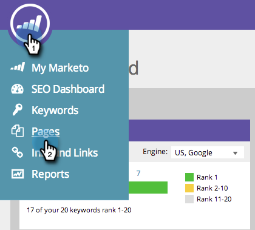

# SEO - Optimera specifika sidor med riktade nyckelord {#seo-optimize-specific-pages-with-targeted-keywords}

Vissa nyckelord fungerar bra med vissa sidor. Så här matchar du det perfekta nyckelordet till den perfekta sidan. Detta ger de mest korrekta data och de bästa rekommendationerna för förbättring.

>[!IMPORTANT]
>
>Den 31 mars 2026 kommer Marketo Engage att ersätta sökmotoroptimeringsfunktionen. Exportera alla relevanta uppgifter den 30 mars eller före den 30 mars. [Läs mer](https://nation.marketo.com/t5/product-blogs/marketo-engage-seo-feature-deprecation/ba-p/359060){target="_blank"}.
>
>* [Exportproblem](https://experienceleague.adobe.com/sv/docs/marketo/using/product-docs/additional-apps/seo/pages/seo-export-issues-to-csv){target="_blank"}
>* [Exportera nyckelordsresultat](https://experienceleague.adobe.com/sv/docs/marketo/using/product-docs/additional-apps/seo/keywords/seo-exporting-keyword-results){target="_blank"}
>* [Exportera nyckelordstrender](https://experienceleague.adobe.com/sv/docs/marketo/using/product-docs/additional-apps/seo/reports/seo-use-the-keyword-trends-report#exporting-data){target="_blank"}
>* [Exportera nyckelordstrender för konkurrent](https://experienceleague.adobe.com/sv/docs/marketo/using/product-docs/additional-apps/seo/reports/seo-use-the-competitor-kw-trends-report#exporting-data){target="_blank"}

1. Gå till avsnittet **[!UICONTROL Pages]**.

   

1. Klicka på sidan som du vill se information om.

   

1. Välj vilket nyckelord du vill optimera sidan för. Klicka på **[!UICONTROL Update]**.

   >[!TIP]
   >
   >Vi rekommenderar att du använder färre än tre nyckelord per sida. Helst bara en.

   

Gör detta för så många sidor och nyckelord som möjligt.
