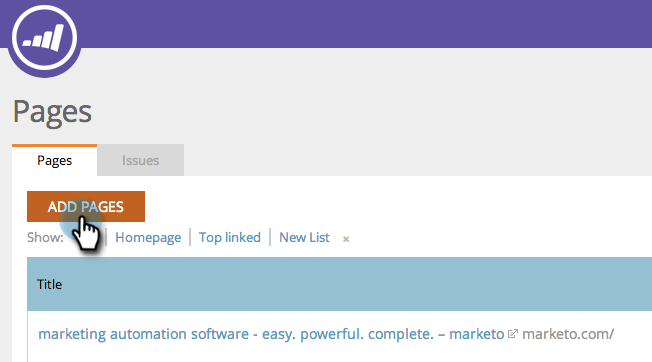

# SEO - lägg till sidor {#seo-add-pages}

Du har sidor! Marketo SEO crawlar automatiskt din webbplats och spårar dem. Om vi missar några kan du få dem i SEO-appen så här:

1. Gå till avsnittet **Sidor**.

   

1. Klicka på **Lägg till sidor**.

   

1. Ange de URL-adresser som du vill lägga till. Klicka på **Lägg till**.

   

   >[!TIP]
   >
   >Visste du att du kan [lägga till sidan i en ny eller befintlig lista](/help/marketo/product-docs/additional-apps/seo/understanding-seo/seo-managing-lists.md)? Kolla in den!

   Det kan ta en stund innan siddata läses in. Vänta på det gröna varningsmeddelandet och uppdatera sidan för att uppdatera visningen.

   

   Nu kan du spåra hur den här sidan fungerar i sökningen.
