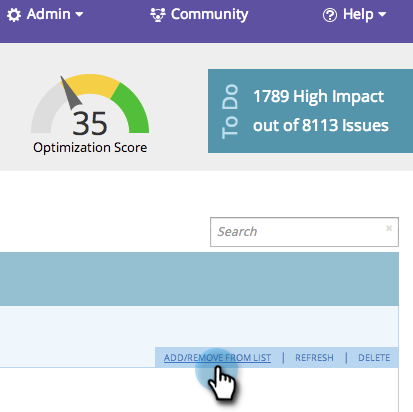

# SEO - Lägg till/ta bort sida från lista {#seo-add-remove-page-from-list}

Vill du hantera sidorna? Det kan du enkelt göra genom att skapa en lista. Du kan använda listor för att ordna sidor eller filtrera data i kontrollpaneler.

## Lägg till sida i en lista {#add-page-to-a-list}

1. Gå till **Sidor** -avsnitt.

   

1. Håll markören över den sida som du vill lägga till i en lista. Klicka **Lägg till/ta bort från lista**.

   

1. Klicka på listan som du vill lägga till sidan i.

   

   >[!TIP]
   >
   >Du kan också skapa en ny lista för sidan. Skriv bara ditt namn i Skapa en ny lista.

1. Klicka på listan som du just har lagt till sidan i.

   

Ja! Sidan bör nu läggas till i listan.

## Ta bort sida från en lista {#remove-page-from-a-list}

1. Gå till avsnittet Sidor.

   

1. På fliken Sidor klickar du på den lista som du vill rensa.

   

1. Hovra över sidan som du vill ta bort. Klicka **Lägg till/ta bort från lista**.

   

1. Klicka på listan som du vill ta bort den från.

   >[!NOTE]
   >
   >Alla listor som nyckelordet hör till för tillfället kommer att markeras. När kontrollen tagits bort från listan försvinner den.

   

Klar. Sidan tas bort från listan.
