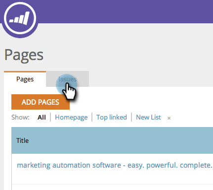
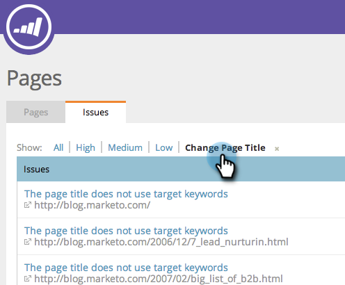

# SEO - Lägg till/ta bort sidproblem från en lista {#seo-add-remove-page-issue-from-a-list}

Du kan ordna dina sidproblem i listor. Du kan också ta bort sidproblem från en lista.

## Lägg till sidproblem i en lista {#add-page-issues-to-a-list}

1. Gå till avsnittet **Sidor**.

   

1. På fliken Sidor klickar du på **Problem**.

   

1. Håll muspekaren över det sidproblem du vill lägga till. Klicka på **Lägg till/ta bort från lista**.

   

   Klicka på den lista som du vill lägga till sidnumret i.

   

   >[!TIP]
   >
   >Du kan också skapa en ny lista där nyckelordet ska placeras. Skriv bara ditt namn i Skapa en ny lista.

## Ta bort sidproblem från en lista {#remove-page-issue-from-a-list}

1. Gå till avsnittet Sidor.

   

1. Klicka på **Problem** på fliken Sidor.

   

1. Klicka på listan som du vill ordna.

   

1. Håll muspekaren över det sidproblem du vill ta bort. Klicka på **Lägg till/ta bort från lista**.

   

1. Listan som du vill ordna bör vara markerad. Klicka på listnamnet för att ta bort sidproblemet från den här listan.

   

Underbar! Uppdatera sidan så visas den inte längre i listan.
