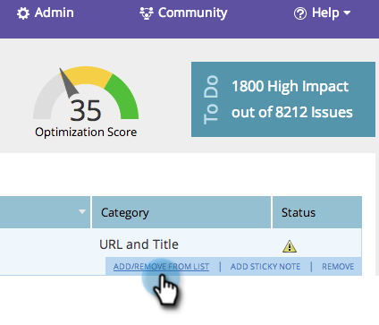
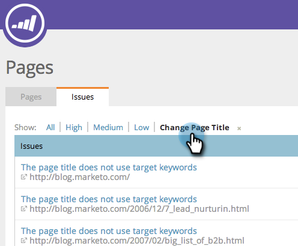

# SEO - Lägg till/ta bort sidproblem från en lista {#seo-add-remove-page-issue-from-a-list}

Du kan ordna dina sidproblem i listor. Du kan också ta bort sidproblem från en lista.

>[!IMPORTANT]
>
>Den 31 mars 2026 kommer Marketo Engage att ersätta sökmotoroptimeringsfunktionen. Exportera alla relevanta uppgifter den 30 mars eller före den 30 mars. [Läs mer](https://nation.marketo.com/t5/product-blogs/marketo-engage-seo-feature-deprecation/ba-p/359060){target="_blank"}.
>
>* [Exportproblem](https://experienceleague.adobe.com/en/docs/marketo/using/product-docs/additional-apps/seo/pages/seo-export-issues-to-csv){target="_blank"}
>* [Exportera nyckelordsresultat](https://experienceleague.adobe.com/en/docs/marketo/using/product-docs/additional-apps/seo/keywords/seo-exporting-keyword-results){target="_blank"}
>* [Exportera nyckelordstrender](https://experienceleague.adobe.com/en/docs/marketo/using/product-docs/additional-apps/seo/reports/seo-use-the-keyword-trends-report#exporting-data){target="_blank"}
>* [Exportera nyckelordstrender för konkurrent](https://experienceleague.adobe.com/en/docs/marketo/using/product-docs/additional-apps/seo/reports/seo-use-the-competitor-kw-trends-report#exporting-data){target="_blank"}

## Lägga till sidproblem i en lista {#add-page-issues-to-a-list}

1. Gå till avsnittet **[!UICONTROL Pages]**.

   

1. Klicka på **[!UICONTROL Pages]** på fliken **[!UICONTROL Issues]**.

   

1. Håll muspekaren över det sidproblem du vill lägga till. Klicka på **[!UICONTROL Add/Remove From List]**.

   

   Klicka på den lista som du vill lägga till sidnumret i.

   

   >[!TIP]
   >
   >Du kan också skapa en ny lista där nyckelordet ska placeras. Skriv bara ditt namn i **[!UICONTROL Create a new list]**.

## Ta bort sidproblem från en lista {#remove-page-issue-from-a-list}

1. Gå till avsnittet **[!UICONTROL Pages]**.

   

1. Klicka på **[!UICONTROL Issues]** på fliken Sidor.

   

1. Klicka på listan som du vill ordna.

   

1. Håll muspekaren över det sidproblem du vill ta bort. Klicka på **[!UICONTROL Add/Remove From List]**.

   

1. Listan som du vill ordna bör vara markerad. Klicka på listnamnet för att ta bort sidproblemet från den här listan.

   

Underbar! Uppdatera sidan så visas den inte längre i listan.
