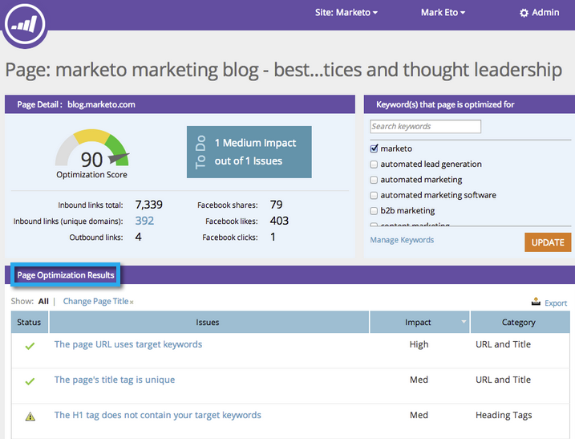

# SEO - Exportera problem till CSV {#seo-export-issues-to-csv}

1. Du kan exportera dina [sidutgivningsdata](seo-understanding-pages.md) till en CSV-fil om du vill dela den informationen med personer utanför Marketo. Så här gör du.
1. Gå till avsnittet **Sidor** .

   

1. Klicka på sidan som du vill se information om.

   

   Det här är detaljnivån för [sidan nedåt](seo-using-the-page-detail-drill-down.md). **Sidoptimeringsresultat** är en lista med alla problem som gäller den aktuella sidan.

   

1. Klicka på **Exportera**.

   

1. Perfekt! Du har nu laddat ned alla problem med den här sidan till en CSV-fil. Ganska coolt, va?

