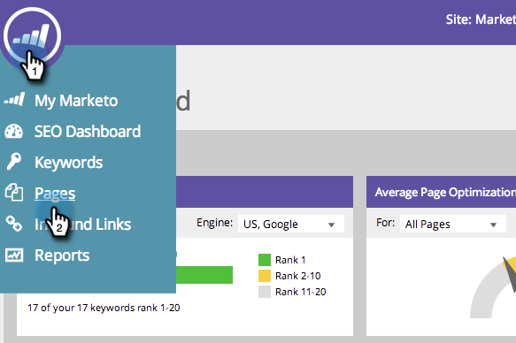
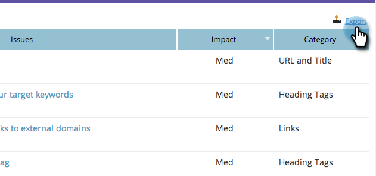

# SEO - Exportera problem till CSV {#seo-export-issues-to-csv}

Du kan exportera dina [sidproblem](/help/marketo/product-docs/additional-apps/seo/pages/seo-understanding-pages.md) data till en CSV-fil om du vill dela informationen med personer utanför Marketo. Så här gör du.

1. Gå till **[!UICONTROL Pages]** -avsnitt.

   

1. Klicka på sidan som du vill se information om.

   

   Det här är [Detaljnivå för sida ned](/help/marketo/product-docs/additional-apps/seo/pages/seo-using-the-page-detail-drill-down.md). **[!UICONTROL Page Optimization Results]** är en lista med alla problem som gäller den aktuella sidan.

   

1. Klicka på **[!UICONTROL Export]**.

   

Perfekt! Du har nu laddat ned alla problem med den här sidan till en CSV-fil.
