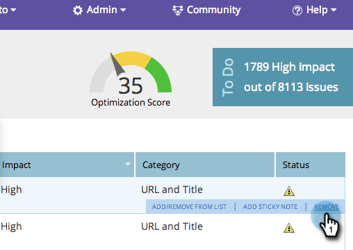

# SEO - Ta bort/ta bort ett sidproblem {#seo-remove-delete-a-page-issue}

Alla sidproblem kan inte vara användbara för dig. Så här tar du bort en sådan.

1. Gå till **[!UICONTROL Pages]** -avsnitt.

   

1. I [!UICONTROL Pages] avsnitt, klicka **[!UICONTROL Issues]**.

   

1. Håll muspekaren över det sidproblem du vill ta bort. Klicka på **[!UICONTROL Remove]**.

   

1. Klicka **[!UICONTROL Delete]** kommer permanent att ta bort det här sidproblemet.

   >[!CAUTION]
   >
   >Du kan inte ångra den här åtgärden. När ett problem har tagits bort kan du återskapa det genom att ta bort sidan och lägga till den igen.

   

Ditt sidproblem har nu tagits bort.
