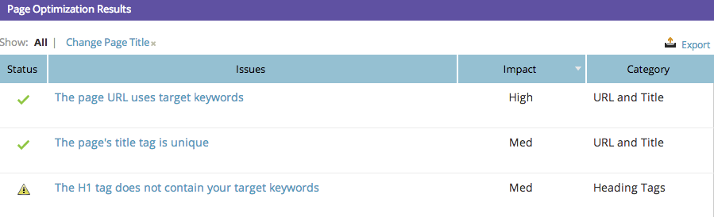

# SEO - Använda detaljnivån {#seo-using-the-page-detail-drill-down}

Du kan se mycket information om dina sidor med detaljnivån nedåt.

## Sök efter sidinformation nedåt {#find-page-drill-down}

1. Gå till avsnittet Sidor.

   

1. Klicka på sidan som du vill se information om.

   

   Se, detaljnivån på sidan går ned!

   

## Siddetaljsektion {#page-detail-section}

| Objekt | Beskrivning |
|---|---|
| Optimeringsresultat | Den hemliga sås som används för att visa hur bra sidan är optimerad för sökning på en skala från 1 till 100. |
| Att göra-ruta | Visar antalet öppna problem med sidan som du är på. |
| Totalt antal inkommande länkar | Det totala antalet inkommande länkar till din webbplats. |
| Inkommande länkar (unika domäner) | Antalet andra webbplatser med minst en inkommande länk till din webbplats. |
| Utgående länkar | Antalet länkar som går ut till andra webbplatser från den här sidan. |
| Facebook Shares | Antal gånger som den här sidan delats på Facebook. |
| Facebook gillar | Antal gånger som den här siddelningen har gillats på Facebook. |
| Facebook Clicks | Antal klickningar från Facebook. |

## Nyckelord som sidan är optimerad för {#keyword-s-that-page-is-optimized-for}

Här [väljer du vilket nyckelord du vill optimera sidan för](/help/marketo/product-docs/additional-apps/seo/keywords/seo-optimize-specific-pages-with-targeted-keywords.md).

>[!NOTE]
>
>Detta är ett viktigt steg mot att få ut det mesta av den här funktionen. Vi rekommenderar att du använder färre än tre nyckelord per sida. Helst bara en.

## Sidoptimeringsresultat {#page-optimization-results}

Resultaten av sidoptimering visar exakt vilka steg du behöver utföra för att öka optimeringspoängen/göra bättre sökningar på den här sidan.

Ganska söt, eller hur? Läs mer om Sidor här.

>[!MORELIKETHIS]
>
>[Optimera specifika sidor med målnyckelord](/help/marketo/product-docs/additional-apps/seo/keywords/seo-optimize-specific-pages-with-targeted-keywords.md)
