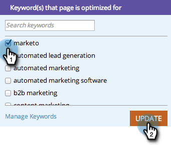

# SEO - Använda detaljnivå för sidan nedåt {#seo-using-the-page-detail-drill-down}

Du kan se mycket information om dina sidor med detaljnivån nedåt.

>[!IMPORTANT]
>
>Den 31 mars 2026 kommer Marketo Engage att ersätta sökmotoroptimeringsfunktionen. Exportera alla relevanta uppgifter den 30 mars eller före den 30 mars. [Läs mer](https://nation.marketo.com/t5/product-blogs/marketo-engage-seo-feature-deprecation/ba-p/359060){target="_blank"}.
>
>* [Exportproblem](https://experienceleague.adobe.com/en/docs/marketo/using/product-docs/additional-apps/seo/pages/seo-export-issues-to-csv){target="_blank"}
>* [Exportera nyckelordsresultat](https://experienceleague.adobe.com/en/docs/marketo/using/product-docs/additional-apps/seo/keywords/seo-exporting-keyword-results){target="_blank"}
>* [Exportera nyckelordstrender](https://experienceleague.adobe.com/en/docs/marketo/using/product-docs/additional-apps/seo/reports/seo-use-the-keyword-trends-report#exporting-data){target="_blank"}
>* [Exportera nyckelordstrender för konkurrent](https://experienceleague.adobe.com/en/docs/marketo/using/product-docs/additional-apps/seo/reports/seo-use-the-competitor-kw-trends-report#exporting-data){target="_blank"}

## Sök efter sidinformation nedåt {#find-page-drill-down}

1. Gå till avsnittet **[!UICONTROL Pages]**.

   

1. Klicka på sidan som du vill se information om.

   

   Se, detaljnivån på sidan går ned!

   

## [!UICONTROL Page Detail] avsnitt {#page-detail-section}

| Objekt | Beskrivning |
|---|---|
| [!UICONTROL Optimization Score] | Den hemliga sås som används för att visa hur bra sidan är optimerad för sökning på en skala från 1 till 100. |
| [!UICONTROL To Do]-ruta | Visar antalet öppna problem med sidan som du är på. |
| [!UICONTROL Inbound Links Total] | Det totala antalet inkommande länkar till din webbplats. |
| [!UICONTROL Inbound Links (unique domains)] | Antalet andra webbplatser med minst en inkommande länk till din webbplats. |
| [!UICONTROL Outbound Links] | Antalet länkar som går ut till andra webbplatser från den här sidan. |
| [!UICONTROL Facebook Shares] | Antal gånger som den här sidan delades på [!DNL Facebook]. |
| [!UICONTROL Facebook Likes] | Antal gånger som den här sidresursen har gillats på [!DNL Facebook]. |
| [!UICONTROL Facebook Clicks] | Antal klick från [!DNL Facebook share]. |

## [!UICONTROL Keyword(s) that Page is Optimized For]  {#keyword-s-that-page-is-optimized-for}

Här [väljer du vilket nyckelord du vill optimera sidan för ](/help/marketo/product-docs/additional-apps/seo/keywords/seo-optimize-specific-pages-with-targeted-keywords.md).

>[!NOTE]
>
>Detta är ett viktigt steg mot att få ut det mesta av den här funktionen. Vi rekommenderar att du använder färre än tre nyckelord per sida. Helst bara en.

## [!UICONTROL Page Optimization Results] {#page-optimization-results}

[!UICONTROL Page Optimization Results] talar om exakt vilka steg du behöver utföra för att öka optimeringspoängen/göra bättre sökningar efter den här sidan.

>[!MORELIKETHIS]
>
>[Optimera specifika sidor med målnyckelord](/help/marketo/product-docs/additional-apps/seo/keywords/seo-optimize-specific-pages-with-targeted-keywords.md)
