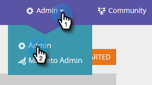
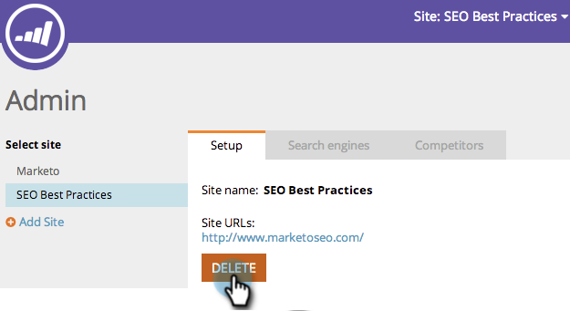

# SEO - Lägg till en plats/ta bort en plats {#seo-add-a-site-delete-a-site}

För att Marketo ska kunna hämta data (inkommande länkar och rekommendationer) som är relevanta för webbplatsens sidor måste du definiera webbplatsens URL här.

>[!AVAILABILITY]
>
>Alla kunder har inte köpt den här funktionen. Kontakta din säljare för mer information.

## Lägg till en plats {#add-a-site}

1. Klicka på listrutan Admin och välj **Admin**.

   >[!NOTE]
   >
   >**Administratörsbehörigheter krävs**

   

1. Klicka på **Lägg till plats**.

   

1. Ange **Namn, URL till webbplats** och klicka på **Spara**.

   >[!TIP]
   >
   >Du kan också lägga till en **blogg-URL** om du har en.

   

   Bra! Du har just lagt till en annan webbplats.

   

## Ta bort en plats {#delete-a-site}

Om du spårar mer än en plats kan du även ta bort en plats som du inte längre är intresserad av att optimera.

1. Klicka på listrutan Admin och välj **Admin**.

   

1. Klicka på den plats du vill ta bort.

   

1. Klicka på **Ta bort**.

   

1. Bekräfta att du vill **ta bort**.

   

   >[!NOTE]
   >
   >Du kan bara ta bort en plats om du har fler än en. Om du bara har en kan du utföra en återställning genom att markera platsen och klicka på **Återställ**. Om du återställer en plats kommer _alla webbplatsdata_ att tas bort och platsen återskapas.
