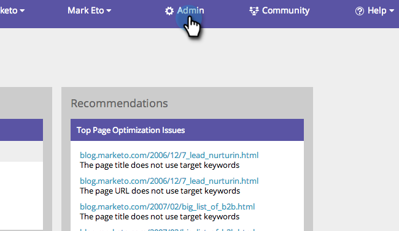

# SEO - Lägg till konkurrenter {#seo-add-competitors}

Genom att lägga till konkurrenter kan du spåra hur de fungerar för samma nyckelord och inkommande länkar som du väljer att övervaka.

>[!NOTE]
>
>**Administratörsbehörigheter krävs**

1. Gå till avsnittet **Admin**.

   

1. Klicka på fliken **Konkurrenter**.

   

1. Klicka på **LÄGG TILL KOMPETITOR**.

   

1. Skriv in **namnet** och **URL** för din konkurrent.

   

   Hög fem! Nu bör du se din konkurrent i listan.

   

   Grattis! Du är ett steg närmare att helt krossa den.

   >[!NOTE]
   >
   >**Relaterade artiklar**
   >
   >    
   >    
   >    * [Lägg till nyckelord](../../../../product-docs/additional-apps/seo/keywords/seo-add-keywords.md)
   >    * [Förstå nyckelord (konkurrentvy)](../../../../product-docs/additional-apps/seo/keywords/seo-understanding-keywords.md)

