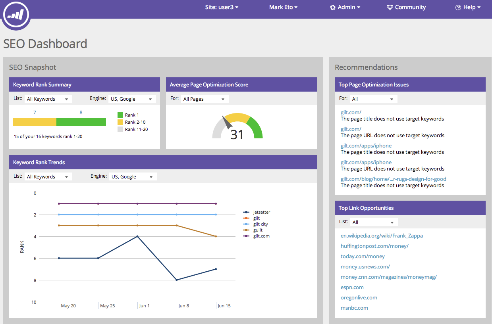
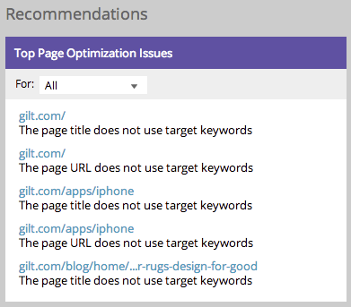
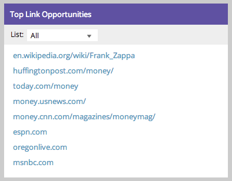

# Förstå SEO-instrumentpanelen: SEO-rekommendationer {#understanding-the-seo-dashboard-seo-recommendations}

Använd kontrollpanelen för att få en översikt över hur nyckelordsrankningarna är trending och hur bra webbplatsen är optimerad för SEO.

>[!IMPORTANT]
>
>Den 31 mars 2026 kommer Marketo Engage att ersätta sökmotoroptimeringsfunktionen. Exportera alla relevanta uppgifter den 30 mars eller före den 30 mars. [Läs mer](https://nation.marketo.com/t5/product-blogs/marketo-engage-seo-feature-deprecation/ba-p/359060){target="_blank"}.
>
>* [Exportproblem](https://experienceleague.adobe.com/en/docs/marketo/using/product-docs/additional-apps/seo/pages/seo-export-issues-to-csv){target="_blank"}
>* [Exportera nyckelordsresultat](https://experienceleague.adobe.com/en/docs/marketo/using/product-docs/additional-apps/seo/keywords/seo-exporting-keyword-results){target="_blank"}
>* [Exportera nyckelordstrender](https://experienceleague.adobe.com/en/docs/marketo/using/product-docs/additional-apps/seo/reports/seo-use-the-keyword-trends-report#exporting-data){target="_blank"}
>* [Exportera nyckelordstrender för konkurrent](https://experienceleague.adobe.com/en/docs/marketo/using/product-docs/additional-apps/seo/reports/seo-use-the-competitor-kw-trends-report#exporting-data){target="_blank"}

Du kan även ta reda på hur du kan förbättra med hjälp av avsnittet [!UICONTROL Recommendations]. Kom så kör vi in!

## [!UICONTROL Top Page Optimization Issues] {#top-page-optimization-issues}

Detta visar fem effektiva sätt att börja optimera webbplatsen direkt! Klicka bara på någon av länkarna för att visa den fullständiga [detaljnivån &#x200B;](/help/marketo/product-docs/additional-apps/seo/pages/seo-using-the-page-detail-drill-down.md){target="_blank"}.

>[!TIP]
>
>Du kan klicka på [!UICONTROL Top Page Optimization Issues] om du vill visa en fullständig lista.

## [!UICONTROL Top Link Opportunities] {#top-link-opportunities}

Att ha välkända webbplatser som länkar till ert innehåll kan öka er sidrankning. Här är några av de främsta prioriteringsmöjligheterna som vi har hittat för din webbplats.

>[!TIP]
>
>Du kan klicka på [!UICONTROL Top Link Optimization] om du vill visa en fullständig lista.

>[!MORELIKETHIS]
>
>[Detaljnivå för sidinformation nere](/help/marketo/product-docs/additional-apps/seo/pages/seo-using-the-page-detail-drill-down.md){target="_blank"}
