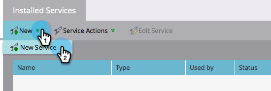

# Lägg till Adobe Connect som en LaunchPoint-tjänst {#add-adobe-connect-as-a-launchpoint-service}

Marketo hanterar registreringen och närvaron av Adobe Connect webbinarium.

>[!NOTE]
>
>**Administratörsbehörigheter krävs**

>[!NOTE]
>
>En befintlig prenumeration på Adobe Connect och administrationsrättigheter krävs för detta steg. Ha följande inställningar till hands: användarnamn, lösenord, deltagarlösenord och URL för mötesmapp.

>[!NOTE]
>
>Adobe Connect On Site stöds för närvarande inte.

1. Gå till **Administratör** område.

   

1. Klicka **LaunchPoint**.

   

1. Klicka på **Nytt** nedrullningsbar meny och välj **Ny tjänst**.

   

1. Ange **Visningsnamn**. Under **Tjänst** väljer du Adobe Connect.

   

1. Ange **Användarnamn** och **Åtkomstkod**.

   

1. Slutför processen genom att ange **URL för mötesmapp** och **Deltagarlösenord** klicka sedan på **Skapa**.

   

   >[!TIP]
   >
   >När du skapar deltagarlösenordet inkluderas det värde du väljer i en frågesträng när länkarna skickas ut för händelsen. Så vi föreslår att ni gör det kundvänligt.

   >[!NOTE]
   >
   >När du har loggat in på ditt Adobe Connect-konto väljer du **Seminarier** -fliken. Utan att behöva gå in på något specifikt seminarium kopierar du URL:en från webbläsarfältet till **URL för mötesmapp** inställning.

Din Adobe Connect-tjänst synkroniseras nu med Marketo!

>[!MORELIKETHIS]
>
>Lär dig hur [skapa ett event med Adobe Connect](/help/marketo/product-docs/demand-generation/events/create-an-event/create-an-event-with-adobe-connect.md){target=&quot;_blank&quot;}.
