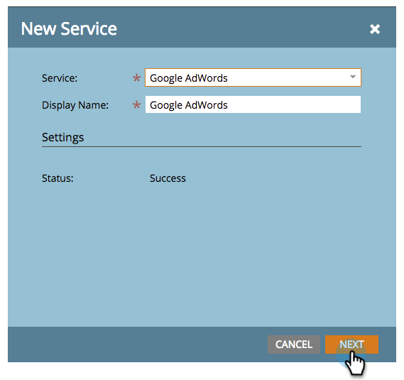

# Lägg till Google AdWords som en LaunchPoint-tjänst {#add-google-adwords-as-a-launchpoint-service}

Länka ditt Google AdWords-konto till Marketo för att automatiskt överföra konverteringsdata offline från Marketo till Google AdWords. Sedan kan ni från gränssnittet för AdWords enkelt se vilka klick som resulterat i kvalificerade leads, affärsmöjligheter och nya kunder (eller vilka intäktssteg ni vill spåra) efter att ni [lagt till anpassade kolumner](https://support.google.com/adwords/answer/3073556) i AdWords. Den här informationen visas inte i Marketo-gränssnittet.

Läs mer om [Googles importfunktion](https://support.google.com/adwords/answer/2998031?hl=en)för offlinekonvertering.

>[!NOTE]
>
>**Administratörsbehörigheter krävs**

>[!NOTE]
>
>Du kan även integrera en [Google AdWords som en Launchpoint-tjänst med ett hanterarkonto](add-google-adwords-as-a-launchpoint-service-with-a-manager-account.md).

1. Gå till avsnittet **Admin** .

   

1. Välj **LaunchPoint**.

   

1. Välj **Ny** och **Ny tjänst**.

   

1. Ange ett visningsnamn och välj **Google AdWords**.

   

1. Välj **Authorize Marketo**.

   >[!NOTE]
   >
   >Se till att logga ut från ditt personliga Gmail-konto och aktivera popup-fönster.

   

1. Välj det konto som är kopplat till Google AdWords.

   

1. Välj **Acceptera**.

   

1. Status visas som **Slutfört**. Välj **Nästa**.

   

1. Ladda upp dina offlinekonverteringar från Marketo till Google AdWords **Weekly **eller **Daily**.

   

1. Attributkonvertering till **första klickningen** eller **sista klicket**.

   | Typ | Definition |
   |---|---|
   | Första klickningen | Offlinekonverteringar tilldelas de första AdWords och den person som klickat de senaste 90 dagarna |
   | Sista klickningen | Offlinekonverteringar tilldelas de sista AdWords och som en person klickade på |

   >[!NOTE]
   >
   >En konsekvent attribueringsmodell i Marketo och AdWords ger den mest korrekta informationen.

   

1. Klicka på **Skapa**.

   

   >[!NOTE]
   >
   >[Automatisk taggning](https://support.google.com/adwords/answer/1752125?hl=en) måste vara markerat för att den här funktionen ska fungera. Inaktiveringen måste göras i AdWords.

   >[!NOTE]
   >
   >**Relaterade artiklar**
   >
   >    
   >    
   >    * [Ange Google AdWords-konverteringar i intäktsmodellen](../../../product-docs/reporting/revenue-cycle-analytics/revenue-cycle-models/set-google-adwords-conversions-in-the-revenue-model.md)

Bra! Se den relaterade artikeln nedan för att lära dig hur du mappar AdWords-offlinekonverteringar i din intäktsmodell.