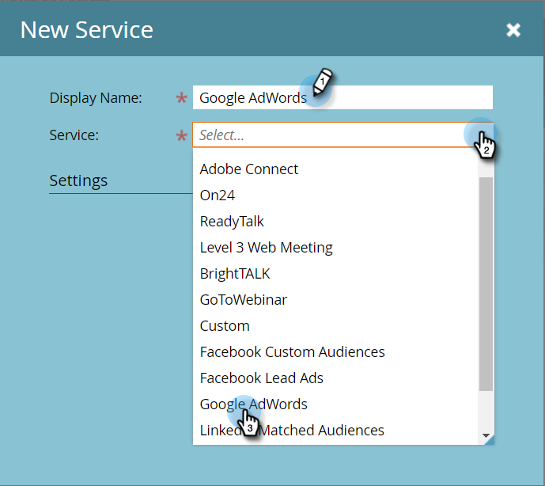

# Lägg till Google AdWords som en LaunchPoint-tjänst {#add-google-adwords-as-a-launchpoint-service}

Länka ditt Google AdWords-konto till Marketo för att automatiskt överföra offlinekonverteringsdata från Marketo till Google AdWords. Sedan kan ni utifrån AdWords-gränssnittet enkelt se vilka klick som resulterat i kvalificerade leads, affärsmöjligheter och nya kunder (eller vilka intäktssteg ni vill spåra) efter att ni gjort det [lägga till egna kolumner](https://support.google.com/adwords/answer/3073556){target="_blank"} i AdWords. Den här informationen visas inte i användargränssnittet för Marketo.

Läs mer om [Google importfunktion för offlinekonvertering](https://support.google.com/adwords/answer/2998031?hl=en){target="_blank"}.

>[!AVAILABILITY]
>
>Alla kunder har inte köpt den här funktionen. Kontakta kontoteamet (din kontoansvarige) för mer information.

>[!NOTE]
>
>**Administratörsbehörigheter krävs**

>[!NOTE]
>
>Du kan även integrera en [Google AdWords as a Launchpoint service with a manager account](/help/marketo/product-docs/administration/additional-integrations/add-google-adwords-as-a-launchpoint-service-with-a-manager-account.md){target="_blank"}.

1. Gå till **Administratör** -avsnitt.

   

1. Välj **LaunchPoint**.

   

1. Välj **Nytt** och **Ny tjänst**.

   

1. Ange ett visningsnamn och välj **Google AdWords**.

   

1. Välj **Auktorisera Marketo**.

   >[!NOTE]
   >
   >Se till att logga ut från ditt personliga Gmail-konto och aktivera popup-fönster.

   

1. Välj det konto som är kopplat till Google AdWords.

   

1. Välj **Acceptera**.

   

1. Status visas som **Lyckades**. Välj **Nästa**.

   

1. Ladda upp offlinekonverteringar från Marketo till Google AdWords **Vecka** eller **Dagligen**.

   

1. Attributkonvertering till **Första klickningen** eller **Sista klickningen**.

   

   | Typ | Definition |
   |---|---|
   | Första klickningen | Offlinekonverteringar tilldelas de första AdWords och den person som klickat de senaste 90 dagarna |
   | Sista klickningen | Offlinekonverteringar tilldelas de sista AdWords och som en person klickade på |

   >[!NOTE]
   >
   >En konsekvent attribueringsmodell i Marketo och AdWords ger den mest korrekta informationen.

1. Klicka **Skapa**.

   

   >[!NOTE]
   >
   >[Automatisk taggning](https://support.google.com/adwords/answer/1752125?hl=en){target="_blank"} måste väljas för att den här funktionen ska fungera. Inaktiveringen måste göras i AdWords.

Bra! Se den relaterade artikeln nedan för att lära dig hur du mappar AdWords-offlinekonverteringar i din intäktsmodell.

>[!MORELIKETHIS]
>
>[Ange Google AdWords-konverteringar i intäktsmodellen](/help/marketo/product-docs/reporting/revenue-cycle-analytics/revenue-cycle-models/set-google-adwords-conversions-in-the-revenue-model.md){target="_blank"}
