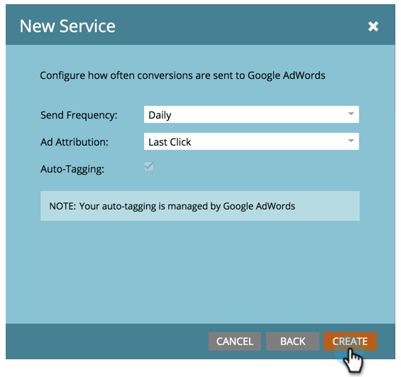

# Lägg till [!DNL Google AdWords] som [!DNL LaunchPoint] Tjänst {#add-google-adwords-as-a-launchpoint-service}

Länka [!DNL Google AdWords] till Marketo för att automatiskt överföra konverteringsdata offline från Marketo till [!DNL Google AdWords]. Sedan, från [!DNL AdWords] Gränssnittet gör att du enkelt kan se vilka klick som resulterat i kvalificerade leads, möjligheter och nya kunder (eller vilka intäktssteg du vill spåra) efter att du [lägga till egna kolumner](https://support.google.com/adwords/answer/3073556){target="_blank"} in [!DNL AdWords]. Den här informationen visas inte i användargränssnittet för Marketo.

Läs mer om [Google importfunktion för offlinekonvertering](https://support.google.com/adwords/answer/2998031?hl=en){target="_blank"}.

>[!AVAILABILITY]
>
>Alla kunder har inte köpt den här funktionen. Kontakta kontoteamet (din kontoansvarige) för mer information.

>[!NOTE]
>
>**Administratörsbehörigheter krävs**

>[!NOTE]
>
>Du kan även integrera en [[!DNL Google AdWords] as a [!DNL Launchpoint] tjänst med ett chefskonto](/help/marketo/product-docs/administration/additional-integrations/add-google-adwords-as-a-launchpoint-service-with-a-manager-account.md){target="_blank"}.

1. Gå till **[!UICONTROL Admin]** område.

   

1. Välj **[!UICONTROL LaunchPoint]**.

   

1. Välj **[!UICONTROL New]** och **[!UICONTROL New Service]**.

   

1. Ange [!UICONTROL display name] och markera **[!UICONTROL Google AdWords]**.

   

1. Välj **[!UICONTROL Authorize Marketo]**.

   >[!NOTE]
   >
   >Se till att logga ut från din personliga [!DNL Gmail] och aktivera popup-fönster.

   

1. Välj det konto som är kopplat till [!DNL Google AdWords].

   

1. Välj **[!UICONTROL Accept]**.

   

1. Status visas som **[!UICONTROL Success]**. Välj **[!UICONTROL Next]**.

   

1. Ladda upp offlinekonverteringar från Marketo till [!DNL Google AdWords] **[!UICONTROL Weekly]** eller **[!UICONTROL Daily]**.

   

1. Attributkonvertering till **[!UICONTROL First Click]** eller **[!UICONTROL Last Click]**.

   

   | Typ | Definition |
   |---|---|
   | [!UICONTROL First Click] | Offlinekonverteringar tilldelas den första [!DNL AdWords] och att en person har klickat de senaste 90 dagarna |
   | [!UICONTROL Last Click] | Offlinekonverteringar tilldelas den sista [!DNL AdWords] och att en person klickade |

   >[!NOTE]
   >
   >Använda en konsekvent attribueringsmodell i Marketo och [!DNL AdWords] ger de mest korrekta data.

1. Klicka på **[!UICONTROL Create]**.

   

   >[!NOTE]
   >
   >[Automatisk taggning](https://support.google.com/adwords/answer/1752125?hl=en){target="_blank"} måste väljas för att den här funktionen ska fungera. Inaktiveringen måste göras inifrån [!DNL AdWords].

Bra! Se den relaterade artikeln nedan för att lära dig hur du mappar [!DNL AdWords] offlinekonverteringar i intäktsmodellen.

>[!MORELIKETHIS]
>
>[Ange [!DNL Google AdWords] Konverteringar i intäktsmodellen](/help/marketo/product-docs/reporting/revenue-cycle-analytics/revenue-cycle-models/set-google-adwords-conversions-in-the-revenue-model.md){target="_blank"}
