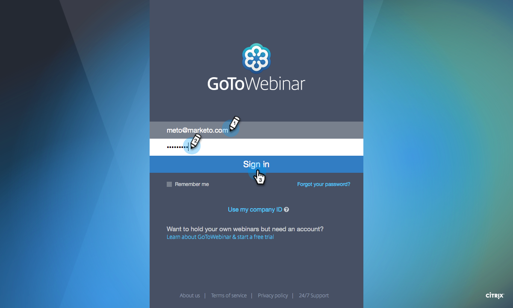
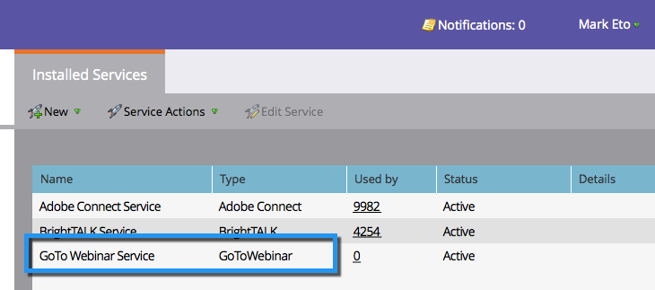

# Lägg till GoToWebinar som en LaunchPoint-tjänst {#add-gotowebinar-as-a-launchpoint-service}

Marketo hanterar registrering och närvaro av GoToWebinar.

>[!NOTE]
>
>**Administratörsbehörigheter krävs**

>[!NOTE]
>
>En befintlig prenumeration på GoToWebinar och administrationsrättigheter krävs för det här steget. Ha den e-postadress och det lösenord du använder för att logga in på GoToWebinar till hands.

>[!NOTE]
>
>GoToMeeting, GoToWebcast och GoToTraining stöds för närvarande inte.

1. Gå till **Admin** och välj **LaunchPoint**.

   

1. Välj **Ny** och **Ny tjänst**.

   

1. Ange ett **visningsnamn**. Under **Service** väljer du **GoToWebinar**.

   

1. Klicka sedan på **Logga in på GoToWebinar**.

   

   >[!NOTE]
   >
   >Om du vill synkronisera företagsnamn och jobbtitel från Marketto-formuläret till GoToWebinar markerar du rutan **Aktivera ytterligare fält**.

1. I popup-fönstret GoToWebinar Logga in anger du ditt **GoToWebinar**-e-postadress och lösenord och klickar på **Logga in**.

   

1. När fönstret stängs klickar du på **Skapa**.

   

1. Bra! Ditt **GoToWebinar**-konto har nu synkroniserats med Marketo.

   

>[!CAUTION]
>
>När du uppdaterar ditt lösenord i GoToWebinar måste du även uppdatera ditt lösenord i Marketo.

>[!MORELIKETHIS]
>
>Lär dig hur du [skapar en händelse med GotoWebinar](/help/marketo/product-docs/demand-generation/events/create-an-event/create-an-event-with-gotowebinar.md).
