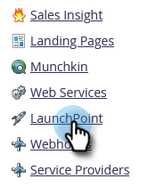

# Lägg till GoToWebinar som en LaunchPoint-tjänst {#add-gotowebinar-as-a-launchpoint-service}

Marketo hanterar registrering och närvaro av GoToWebinar.

>[!NOTE]
>
>**Administratörsbehörigheter krävs**

>[!NOTE]
>
>En befintlig prenumeration på GoToWebinar och administrationsrättigheter krävs för det här steget. Ha den e-postadress och det lösenord du använder för att logga in på GoToWebinar till hands.

>[!NOTE]
>
>GoToMeeting, GoToWebcast och GoToTraining stöds för närvarande inte.

1. Gå till **Administratör** område.

   

1. Klicka **LaunchPoint**.

   

1. Välj **Nytt** och **Ny tjänst**.

   

1. Ange **Visningsnamn**. Under **Tjänst**, markera **GoToWebinar**.

   

1. Klicka på **Logga in på GoToWebinar**.

   

   >[!NOTE]
   >
   >Om du vill synkronisera företagsnamn och jobbtitel från ditt Marketo-formulär till GoToWebinar väljer du **Aktivera ytterligare fält** box.

1. I popup-fönstret GoToWebinar Sign In anger du **GoToWebinar** e-post och lösenord och klicka **Logga in**.

   

1. När fönstret stängs klickar du på **Skapa**.

   

1. Bra! Dina **GoToWebinar** kontot har nu synkroniserats med Marketo.

   

>[!CAUTION]
>
>När du uppdaterar ditt lösenord i GoToWebinar måste du även uppdatera ditt lösenord i Marketo.

>[!MORELIKETHIS]
>
>Lär dig hur [skapa en händelse med GotoWebinar](/help/marketo/product-docs/demand-generation/events/create-an-event/create-an-event-with-gotowebinar.md){target=&quot;_blank&quot;}.
