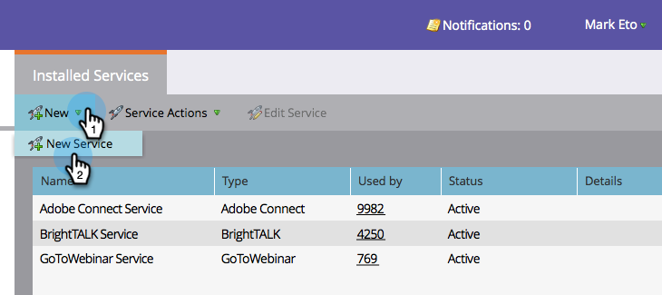

# Lägg till webbmöte på nivå 3 som en startpunktstjänst {#add-level-web-meeting-as-a-launchpoint-service}

Marketo hanterar registrering och närvaro i Level 3 Web Meeting.

>[!NOTE]
>
>**Administratörsbehörigheter krävs**

>[!NOTE]
>
>**Påminnelse**
>
>En befintlig prenumeration på Level 3 Web Meeting och administrationsrättigheter krävs för det här steget. Ha ditt åtkomstnummer, åtkomstkod och lösenord till hands.

1. Gå till **Admin** och välj **LaunchPoint**.

   

1. Välj **Ny** och sedan **Ny** **tjänst**.

   

1. Ange ett **visningsnamn** **för**. Under **Service** väljer du **Level 3 Web Meeting**.

   

1. Ange ditt **Access** - **nummer**, **Access** - **kod** och **lösenord****** och klicka sedan på¥Create¥.

   

1. Fenomenal! Ditt** Level 3 Web Meeting**-konto har nu synkroniserats med Marketo.

   

>[!NOTE]
>
>**Relaterade artiklar**
>
>Lär dig hur du [skapar en händelse med ett webbmöte](../../../product-docs/demand-generation/events/create-an-event/create-an-event-with-level-3-web-meeting.md)på Nivå 3.

