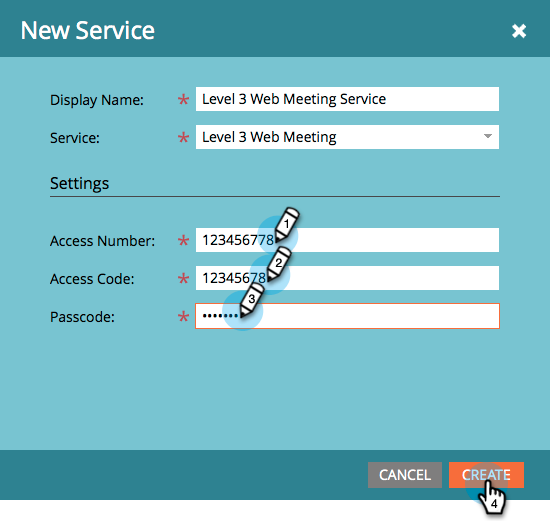

# Lägg till [!DNL Level 3 Web Meeting] som en [!DNL LaunchPoint]-tjänst {#add-level-three-web-meeting-as-a-launchpoint-service}

Marketo hanterar din registrering och närvaro av [!DNL Level 3 Web Meeting].

>[!NOTE]
>
>**Administratörsbehörigheter krävs**

>[!NOTE]
>
>En befintlig prenumeration på [!DNL Level 3 Web Meeting] och administrationsrättigheter krävs för det här steget. Ha ditt åtkomstnummer, åtkomstkod och lösenord till hands.

1. Gå till området **[!UICONTROL Admin]**.

   

1. Klicka på **[!UICONTROL LaunchPoint]**.

   

1. Välj **[!UICONTROL New]** och sedan **[!UICONTROL New Service]**.

   

1. Ange **[!UICONTROL Display Name]**. Välj **[!UICONTROL Level 3 Web Meeting]** under **[!UICONTROL Service]**.

   

1. Ange din **[!UICONTROL Access Number]**, **[!UICONTROL Access Code]** och **[!UICONTROL Passcode]** och klicka sedan på **[!UICONTROL Create]**.

   

Ditt [!DNL Level 3 Web Meeting]-konto har synkroniserats med Marketo!

>[!MORELIKETHIS]
>
>Lär dig hur du [skapar en händelse med en [!DNL Level 3 Web Meeting]](/help/marketo/product-docs/demand-generation/events/create-an-event/create-an-event-with-level-3-web-meeting.md){target="_blank"}.
