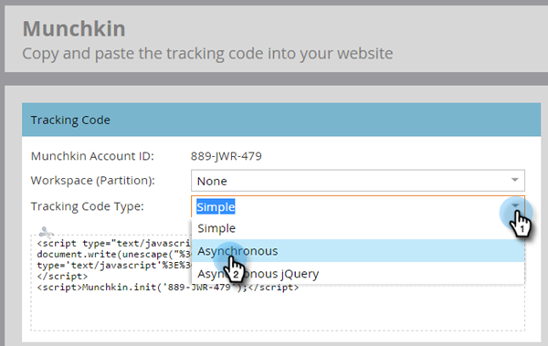

# Lägg till [!DNL Munchkin] spårningskod på webbplatsen {#add-munchkin-tracking-code-to-your-website}

Marketo anpassade JavaScript-spårningskod, [!DNL Munchkin], spårar alla personer som besöker din webbplats så att du kan reagera på deras besök med automatiserade marknadsföringskampanjer. Även anonyma besökare spåras tillsammans med sina IP-adresser och annan information. **Utan den här spårningskoden kan du inte spåra besök eller annan aktivitet på din webbplats**!

>[!PREREQUISITES]
>
>Se till att du har tillgång till en erfaren JavaScript-utvecklare. Marketo tekniska support är inte konfigurerad för att hjälpa till med felsökning av anpassade JavaScript.

## Lägg till spårningskod på din webbplats {#add-tracking-code-to-your-website}

>[!NOTE]
>
>Adobe Experience Cloud-användare kan också använda [Marketo-integreringen i Adobe Launch](https://exchange.adobe.com/apps/ec/100223/adobe-launch-core-extension){target="_blank"} för att inkludera [!DNL Munchkin]-skript på sina webbsidor. Om du använder Adobe Launch läggs _skriptet [!DNL Munchkin] till automatiskt_, så du behöver inte lägga till det själv.

1. Gå till området **[!UICONTROL Admin]**.

   

1. Klicka på **[!UICONTROL Munchkin]**.

   

1. Välj **[!UICONTROL Asynchronous]** för **[!UICONTROL Tracking Code Type]**.

   

   >[!NOTE]
   >
   >I nästan alla fall bör du använda den asynkrona koden. [Läs mer](#types-of-munchkin-tracking-codes).

1. Klicka på och kopiera den Javascript-spårningskod som du vill använda på webbplatsen.

   

   >[!CAUTION]
   >
   >Använd inte koden som visas på skärmbilden - du måste använda den unika koden som visas på ditt konto!

   >[!TIP]
   >
   >Lägg in spårningskod på de webbsidor som du vill spåra. Det kan vara varje sida för mindre webbplatser, eller bara nyckelsidor på webbplatser som har många dynamiskt genererade webbsidor, användarforum och så vidare.

   För bästa resultat bör du använda den asynkrona [!DNL Munchkin]-koden och placera den inuti `<head>` -elementen på sidorna. Om du använder den enkla koden (rekommenderas inte) är detta precis före taggen `</body>`.

   

   >[!TIP]
   >
   >För webbplatser med stor trafik (dvs. hundratusentals besök per månad) rekommenderar vi att du inte spårar anonyma personer. [Läs mer](https://experienceleague.adobe.com/en/docs/marketo-developer/marketo/javascriptapi/lead-tracking/){target="_blank"}.

## Lägg till spårningskod när flera arbetsytor används {#add-tracking-code-when-using-multiple-workspaces}

Om du använder Arbetsytor i ditt Marketo-konto har du förmodligen också separata webblänkar som motsvarar dina arbetsytor. I så fall kan du använda [!DNL Munchkin]-spårnings-JavaScript för att tilldela anonyma personer till rätt arbetsyta och partition.

1. Gå till området **[!UICONTROL Admin]**.

   

1. Klicka på **[!UICONTROL Munchkin]**.

   

1. Välj lämplig arbetsyta för de webbsidor som du vill spåra.

   

   >[!NOTE]
   >
   >Om du inte använder den speciella arbetsytans [!DNL Munchkin]-kod tilldelas personerna standardpartitionen som skapades när ditt konto konfigurerades. Det har ursprungligen namnet [!UICONTROL Default], men du kan ha ändrat det i ditt Marketo-konto.

1. Välj **[!UICONTROL Asynchronous]** för **[!UICONTROL Tracking Code Type]**.

   

1. Klicka på och kopiera spårningskoden för JavaScript för att lägga ut den på webbplatsen.

   

   >[!CAUTION]
   >
   >Använd inte koden som visas på skärmbilden - du måste använda den unika koden som visas på ditt konto!

1. Placera spårningskoden på dina webbsidor i elementet `<head>`. Nya personer som besöker den här sidan tilldelas den här partitionen.

   

   >[!CAUTION]
   >
   >Du kan bara använda ett [!DNL Munchkin]-spårningsskript för en enskild partition och arbetsyta på en sida. Ta inte med spårningsskript för flera partitioner/arbetsytor på webbplatsen.

   >[!NOTE]
   >
   >Landningssidor som skapats i Marketo innehåller automatiskt spårningskod, så du behöver inte placera den här koden på dem.

## Typer av [!DNL Munchkin] spårningskoder {#types-of-munchkin-tracking-codes}

Det finns tre typer av [!DNL Munchkin] spårningskoder som du kan välja mellan. Alla effekter påverkar webbsidans laddningstider på olika sätt.

1. **[!UICONTROL Simple]**: har minst antal kodrader, men optimerar inte för webbsidans inläsningstid. Den här koden läser in jQuery-biblioteket varje gång en webbsida läses in.
1. **[!UICONTROL Asynchronous]**: minskar inläsningstiden för webbsidor.
1. **[!UICONTROL Asynchronous jQuery]**: minskar inläsningstiden för webbsidor och förbättrar även systemprestanda. Den här koden förutsätter att du redan har jQuery och inte kontrollerar att den har lästs in.

## Testa om din [!DNL Munchkin]-kod fungerar {#test-if-your-munchkin-code-is-working}

Så här kontrollerar du att din [!DNL Munchkin]-kod fungerar när du har lagt till den:

1. Besök din webbsida.

1. Klicka på rutan **[!UICONTROL Analytics]** i [!DNL My Marketo].

   

1. Klicka på **[!UICONTROL Web Page Activity]**.

   

1. Klicka på fliken **[!UICONTROL Setup]** och dubbelklicka på **[!UICONTROL Activity Source]**.

   

1. Ändra [!UICONTROL Activity Source] till **[!UICONTROL Anonymous Visitors (including ISPs)]** och klicka på **[!UICONTROL Apply]**.

   

1. Klicka på fliken **[!UICONTROL Report]**.

   

   >[!NOTE]
   >
   >Om du inte ser några data väntar du några minuter och klickar sedan på uppdateringsikonen längst ned.
