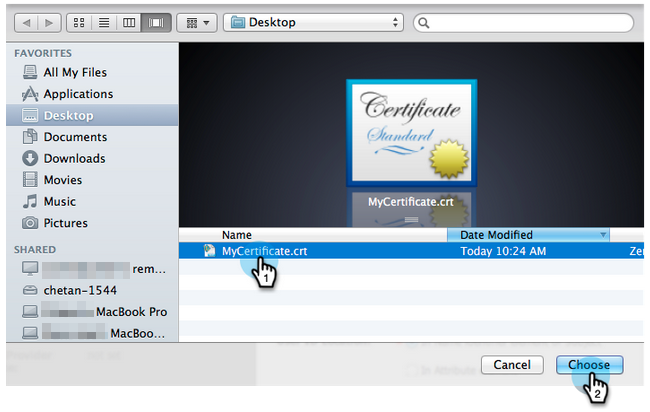
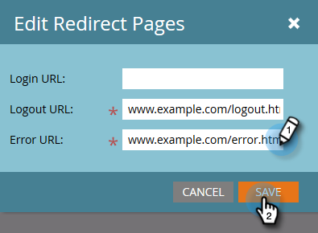

# Lägg till enkel inloggning på en portal {#add-single-sign-on-to-a-portal}

Om du har en katalogtjänst som autentiserar användare kan du tillåta enkel inloggning (SSO) i Marketo. Vi stöder den här funktionen med [!DNL Security Assertion Markup Language] (SAML) version 2.0 och senare.

Marketo fungerar som en SAML-tjänsteleverantör (SP) och är beroende av en extern identitetsleverantör (IdP) för att autentisera användare.

När enkel inloggning är aktiverad kan IdP validera användarens inloggningsuppgifter. När en användare vill använda Marketo-programvara skickar IdP sedan ett signerat SAML-meddelande till Marketo, som fungerar som SP. Det här meddelandet garanterar Marketo att användaren har behörighet att använda Marketo.

>[!NOTE]
>
>**Administratörsbehörigheter krävs**

>[!NOTE]
>
>Är du [!DNL Microsoft Azure] användare? Kolla in deras [självstudiekurs om integrering](https://azure.microsoft.com/en-us/documentation/articles/active-directory-saas-marketo-tutorial/){target="_blank"}.

## Skicka förfrågan {#how-to-send-the-request}

* Skicka SSO-begäran, som är ett SAML-svar, till `https://login.marketo.com/saml/assertion/<your-munchkin-id>`
* Som SP:s målgrupps-URL. Använd `http://saml.marketo.com/sp`
* Om du använder attributet SPNameQualifier anger du att elementet NameID för Subject ska vara `http://saml.marketo.com/sp`
* Om du federerar flera Marketo-prenumerationer till samma SSO-leverantör kan du använda unika SP-URL:er för varje Marketo-underordnad med formatet `http://saml.marketo.com/sp/<munchkin_id>`

>[!NOTE]
>
>Marketo stöder endast Identity Provider-initierad (kallas även IdP-initierad), där användaren först startar Idp-inloggningssidan, autentiserar och sedan navigerar till Min Marketo.

## Ytterligare information {#additional-notes}

* **Synkroniseringstid** - För en ny användare sker en fördröjning på cirka 10 minuter innan en första enkel inloggningsbegäran behandlas.
* **Användaretablering** - Användare etableras manuellt av Marketo.
* **Behörighet** - Användarbehörigheter behålls inom Marketo.
* **Stöd för OAuth** - Marketo stöder för närvarande inte OAuth.
* **Automatisk användarspridning** - Kallas även&quot;Just in Time Provisioning&quot;, det här är när en användares första SAML-inloggning kan skapa användaren i något webbprogram som han/hon använder (t.ex. Marketo) och ingen manuell administratörsåtgärd krävs. Detta stöds för närvarande inte av Marketo.
* **Kryptering** - Marketo stöder för närvarande inte kryptering.

>[!NOTE]
>
>Innan du startar bör du ha ditt identitetsleverantörscertifikat i X.509-format och i filnamnstillägget .crt, .der eller .cer.

## Uppdatera SAML-inställningar {#update-saml-settings}

SSO är inaktiverat som standard. Följ de här stegen för att aktivera SAML och konfigurera det.

1. Gå till **[!UICONTROL Admin]** område.

   

1. Klicka på **[!UICONTROL Single Sign-On]**.

   

   >[!NOTE]
   >
   >Om du inte ser **[!UICONTROL Single Sign-On]** under **[!UICONTROL Admin]**, kontakt [Marketo Support](https://nation.marketo.com/t5/Support/ct-p/Support){target="_blank"}.

1. Under **[!UICONTROL SAML Settings]** avsnitt, klicka **[!UICONTROL Edit]**.

   

1. Ändra **[!UICONTROL SAML Single Sign-On]** till **[!UICONTROL Enabled]**.

   

1. Ange **[!UICONTROL Issuer ID]**, **[!UICONTROL Entity ID]** väljer du **[!UICONTROL User ID Location]** och sedan klicka **[!UICONTROL Browse]**.

   

1. Välj **[!UICONTROL Identity Provider Certificate]** -fil.

   

1. Klicka på **[!UICONTROL Save]**.

   

## Uppdatera inställningar för omdirigeringssida {#update-redirect-page-settings}

1. Under **[!UICONTROL Redirect Pages]** avsnitt, klicka **[!UICONTROL Edit]**.

   

   >[!NOTE]
   >
   >Kunder som använder Universal ID tillsammans med enkel inloggning måste ange identitetsleverantörens inloggnings-URL i **[!UICONTROL Login URL]** fält.

1. Ange **[!UICONTROL Logout URL]**. Det här är den URL som du vill att användaren ska dirigeras till när han/hon loggar ut från Marketo.

   

1. Ange en **[!UICONTROL Error URL]**. Det här är den URL som du vill att användaren ska dirigeras till om inloggningen till Marketo misslyckas. Klicka på **[!UICONTROL Save]**.

   

   >[!NOTE]
   >
   >Båda dessa sidor måste vara allmänt tillgängliga.

>[!MORELIKETHIS]
>
>* [Använda ett universellt ID för prenumerationsinloggning](/help/marketo/product-docs/administration/settings/using-a-universal-id-for-subscription-login.md){target="_blank"}
>* [Begränsa användarinloggning till enbart enkel inloggning](/help/marketo/product-docs/administration/additional-integrations/restrict-user-login-to-sso-only.md){target="_blank"}
>* [Bjud in Marketo-användare till två instanser med Universal ID](https://nation.marketo.com/t5/Knowledgebase/Inviting-Marketo-Users-to-Two-Instances-with-Universal-ID-UID/ta-p/251122){target="_blank"}
