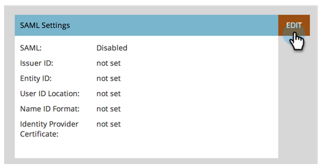
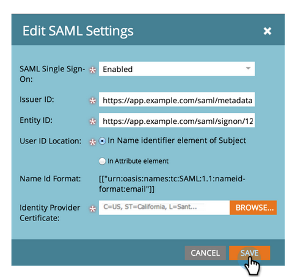
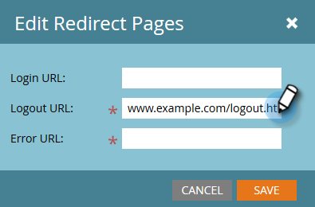

# Lägg till enkel inloggning på en portal {#add-single-sign-on-to-a-portal}

Om du har en katalogtjänst som autentiserar användare kan du tillåta enkel inloggning (SSO) i Marketo. Vi stöder den här funktionen med SAML (Security Assertion Markup Language) version 2.0 och senare.

Marketo fungerar som en SAML Service Provider (SP) och är beroende av en extern identitetsleverantör (IdP) för att autentisera användare.

När enkel inloggning är aktiverad kan IdP validera användarens inloggningsuppgifter. När en användare vill använda Marketo skickar IdP sedan ett signerat SAML-meddelande till Marketo, som fungerar som SP. Det här meddelandet bekräftar för Marketo att användaren har behörighet att använda Marketo.

>[!NOTE]
>
>**Administratörsbehörigheter krävs**

>[!NOTE]
>
>Är du en Microsoft Azure-användare? Ta en titt på deras [självstudiekurs om integrering](https://azure.microsoft.com/en-us/documentation/articles/active-directory-saas-marketo-tutorial/).

## Skicka begäran {#how-to-send-the-request}

* Skicka SSO-begäran, som är ett SAML-svar, till `https://login.marketo.com/saml/assertion/<your-munchkin-id>`
* Som SP:s målgrupps-URL. Använd [http://saml.marketo.com/sp](http://saml.marketo.com/sp)
* Om du använder SPNameQualifier-attributet anger du [http://saml.marketo.com/sp](http://saml.marketo.com/sp) för NameID-elementet för Subject
* Om du federerar flera Marketo-prenumerationer till samma SSO-leverantör kan du använda unika SP-URL:er för varje Marketo-underordnad med formatet `http://saml.marketo.com/sp/<munchkin_id>`

>[!NOTE]
>
>Marketo stöder endast Identity Provider-initierad (kallas även IdP-initierad) där användaren först startar Idp-inloggningssidan, autentiserar och sedan navigerar till My Marketo.

## Ytterligare information {#additional-notes}

* **Synkroniseringstid**  - För en ny användare sker cirka 10 minuters fördröjning innan en första enkel inloggningsbegäran behandlas.
* **Användaretablering**  - Användare etableras manuellt av Marketo.
* **Behörighet**  - Användarbehörigheter finns i Marketo.
* **Stöd**  för OAuth - Marketo stöder för närvarande inte OAuth.

>[!NOTE]
>
>Innan du startar bör du ha ditt identitetsleverantörscertifikat i X.509-format och i filnamnstillägget .crt, .der eller .cer.

## Uppdatera SAML-inställningar {#update-saml-settings}

SSO är inaktiverat som standard. Följ de här stegen för att aktivera SAML och konfigurera det.

1. Gå till **Admin** och klicka på **Enkel inloggning**.

   

   >[!NOTE]
   >
   >Om du inte ser **enkel inloggning** under **Admin**, kontaktar du [[Marketo Support]](https://nation.marketo.com/t5/Support/ct-p/Support).

1. Klicka på **Redigera** under **SAML-inställningar**.

   

1. Ändra **SAML enkel inloggning** till **Aktiverad**.

   

1. Ange ditt **Issuer ID**, **Entity ID**, välj **User ID Location** och klicka sedan på **Browse**.

   

1. Välj din **identitetsleverantörscertifikatfil**.

   

1. Klicka på **Spara**.

   

## Uppdatera inställningar för omdirigeringssida {#update-redirect-page-settings}

1. Klicka på **Redigera** under **Omdirigera sidor**.

   

   >[!NOTE]
   >
   >Kunder som använder Universal ID tillsammans med enkel inloggning måste ange identitetsleverantörens inloggnings-URL i fältet **Inloggnings-URL**.

1. Ange en **Logout URL**. Det här är den URL som du vill att användaren ska dirigeras till när han/hon loggar ut från Marketo.

   

1. Ange en **fel-URL**. Det här är den URL som du vill att användaren ska dirigeras till om det inte går att logga in på Marketo. Klicka på **Spara**.

   

   >[!NOTE]
   >
   >Båda dessa sidor måste vara allmänt tillgängliga.
