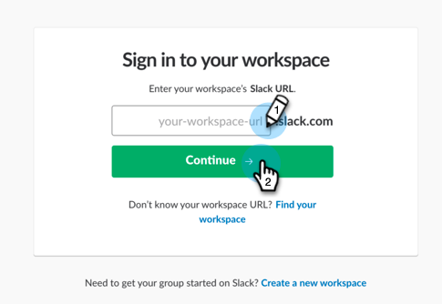

# Lägg till Slack som en LaunchPoint-tjänst {#add-slack-as-a-launchpoint-service}

Det finns två meddelandetyper i integreringen med Slack:

* **Systemmeddelanden**: Få Slack-meddelanden om viktiga händelser i Marketo-instansen, som aviseringar om aktuella kampanjstatus och eventuella problem som kräver omedelbar åtgärd (CRM-fel och API-gränser).
* **Intressanta stunder**: När en Marketo Insight har utlösts av en känd person från ett försäljningskonto kan ledande ägare meddelas via Slack. Meddelanden innehåller information om lead samt detaljer om försäljningskontot.

>[!NOTE]
>
>**Administratörsbehörigheter krävs**

>[!PREREQUISITES]
>
>Om du inte har Slack systemmeddelanden aktiverat kan du [kontakta support](http://docs.marketo.com/cdn-cgi/l/email-protection#1d6e686d6d726f695d707c6f76786972337e7270).

1. Gå till **LaunchPoint** och klicka sedan på **Ny tjänst** under **Ny** tjänst.

   

1. Ange ett visningsnamn för integreringen med Slack. I listrutan **Tjänst** väljer du **Slack**. Klicka på **Skapa**.

   

1. Klicka på **Auktorisera**. Då öppnas Slack på en ny flik, där du fyller i behörigheten och ger Marketo tillstånd att hämta information från Slack.

   

1. Ange arbetsytans URL-adress på fliken Slack och klicka på **Fortsätt**.

   

1. Ange dina inloggningsuppgifter för Slack och klicka på **Logga in**.

   

1. I listrutan **Skicka till** väljer du den kanal där du vill att meddelanden från Marknad ska bokföras. Granska de begärda behörigheterna och klicka sedan på **Auktorisera**.

   

1. Bekräftelseskärmen visas nedan. Fliken stängs automatiskt.

   

1. Uppdatera fliken Marketo och bekräfta att Slack nu visas som en aktiv tjänst i LaunchPoint.

   

   Meddelanden börjar nu att publicera i den kanal du valde i steg 6. De kommer att se ut ungefär så här:

   

