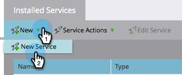
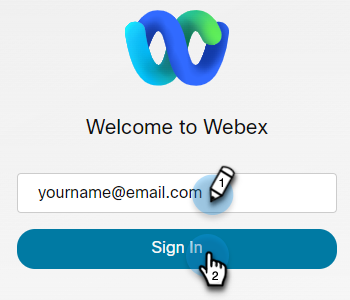

# Lägg till [!DNL Webex] som [!DNL LaunchPoint] Tjänst {#add-webex-as-a-launchpoint-service}

Marketo Engage hanterar dina [!DNL Webex] registrering av webbinarium och närvaro.

>[!NOTE]
>
>**Administratörsbehörigheter krävs**

>[!NOTE]
>
>En befintlig prenumeration på [!DNL Webex] och administrationsrättigheter krävs för detta steg. Ha följande inställningar till hands: Användarnamn, lösenord och platsnamn.

>[!NOTE]
>
>Platsnamnet finns i slutet av den URL som används för att logga in [!DNL Webex]. Exempel:
>
>`https://mycompany.webex.com/mw0300lc/mywebex/default.do?siteurl=mycompany`
>
>**Varning:** Ange inte hela URL:en i detta fält. Ange bara platsnamnet!

1. Gå till **[!UICONTROL Admin]** område.

   

1. Klicka på **[!UICONTROL LaunchPoint]**.

   

1. Välj **[!UICONTROL New]** och sedan **[!UICONTROL New Service]**.

   

1. Ange **[!UICONTROL Display Name]**. Under **[!UICONTROL Service]** väljer du **[!UICONTROL Webex]**.

   

1. Ange **[!UICONTROL Username]** och **[!UICONTROL Password]**.

   

1. Slutför processen genom att ange **[!UICONTROL Site Name]** sedan klicka **[!UICONTROL Create]**.

   

Dina **[!DNL Webex]** är nu synkroniserat med Marketo.

>[!MORELIKETHIS]
>
>Lär dig hur [skapa en händelse med [!DNL Webex]](/help/marketo/product-docs/demand-generation/events/create-an-event/create-an-event-with-webex.md){target="_blank"}.
