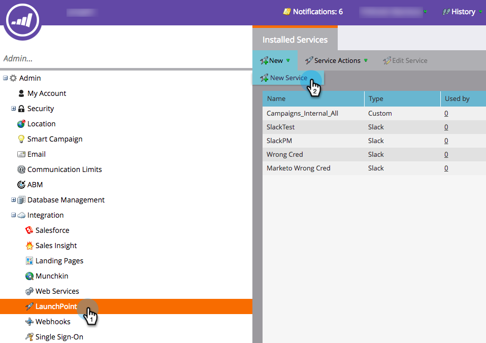
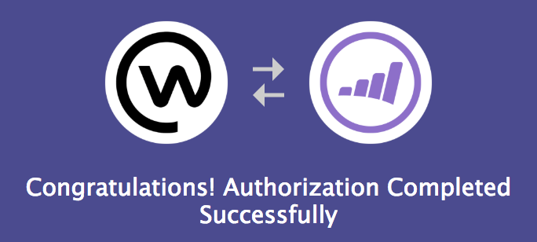
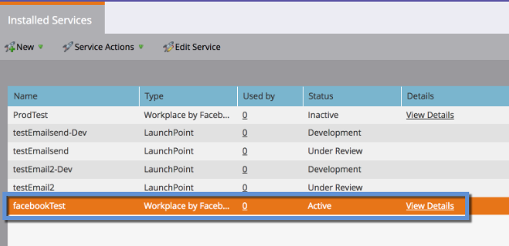

# Lägg till arbetsyta efter Facebook som en LaunchPoint-tjänst {#add-workplace-by-facebook-as-a-launchpoint-service}

Det finns två meddelandetyper i Workplace-integreringen:

* **Systemmeddelanden**: Få Workplace-meddelanden om viktiga händelser i Marketo-instansen, som aviseringar om aktuella kampanjstatusar och eventuella problem som kräver omedelbar åtgärd (CRM-fel och API-gränser).
* **Intressanta stunder**: När en Marketo Insight har utlösts av en känd person från ett försäljningskonto kan leadägare meddelas via Workplace. Meddelanden innehåller information om lead samt detaljer om försäljningskontot.

>[!NOTE]
>
>**Administratörsbehörigheter krävs**

>[!PREREQUISITES]
>
>[Kontakta support](http://docs.marketo.com/cdn-cgi/l/email-protection#5b282e2b2b34292f1b363a29303e2f3475383436) om du inte redan har aktiverat Workplace Notifications.

1. Gå till **LaunchPoint** och klicka sedan på **Ny tjänst** under &lt;a2/>Nytt **.**

   

1. Ange ett visningsnamn för integreringen av arbetsytan. I listrutan **Tjänst** väljer du **Arbetsplats av Facebook**. Klicka på **Skapa**.

   

1. Om du vill få systemmeddelanden och intressanta stunder låter du alternativen vara som de är. Klicka på **Skapa**.

   

1. Klicka på **Auktorisera**. Då öppnas Workplace på en ny flik, där du slutför behörigheten och ger Markering behörighet att hämta information från Workplace.

   

1. På den nya fliken Workplace anger du ditt företags-e-postadress eller Workplace-användarnamn och klickar på **Fortsätt**.

   

1. Ange dina uppgifter för arbetsytan och klicka på **Logga in**.

   

1. I popup-fönstret Arbetsplats väljer du en Facebook-grupp där du vill att meddelanden från Marknad ska publiceras (t.ex. partnerintegreringar). Klicka på **Installera**.

   

1. Bekräftelsemeddelandet visas nedan. Fliken stängs automatiskt.

   

1. Uppdatera fliken Marketto och bekräfta att Workplace nu visas som en aktiv tjänst i LaunchPoint.

   

   Meddelanden kommer nu att börja publicera till den Facebook-grupp du valde i steg 7. De kommer att se ut ungefär så här:

   

