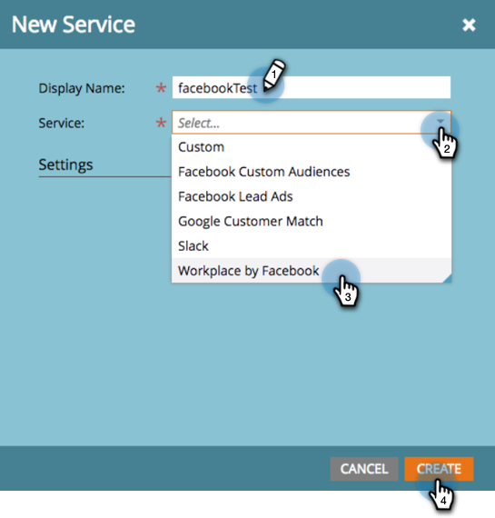
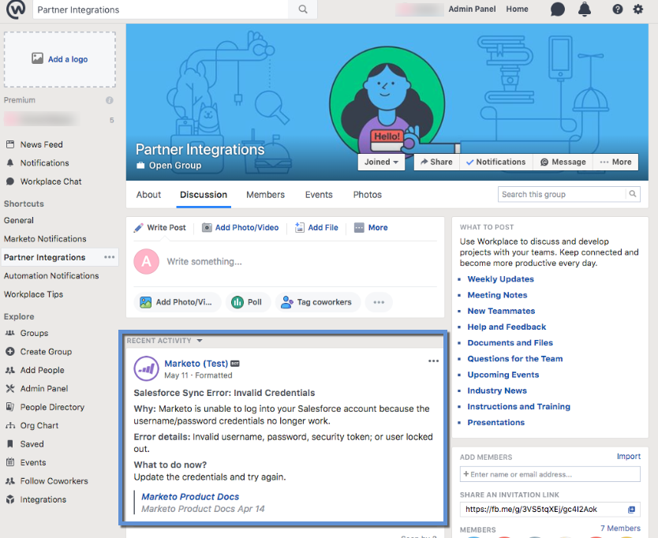

# Lägg till [!DNL Workplace By Facebook] som [!DNL LaunchPoint] Tjänst {#add-workplace-by-facebook-as-a-launchpoint-service}

Det finns två meddelandetyper i [!DNL Workplace] integrering:

* **Systemmeddelanden**: Hämta [!DNL Workplace] meddelanden om viktiga händelser i din Marketo-instans, t.ex. aviseringar om aktuella kampanjstatus och eventuella problem som kräver omedelbar åtgärd (CRM-fel och API-gränser).
* **Intressanta ögonblick**: När en [!DNL Marketo Insight] har utlösts av en känd person från ett försäljningskonto, lead-ägare kan meddelas via [!DNL Workplace]. Meddelanden innehåller information om lead samt detaljer om försäljningskontot.

>[!NOTE]
>
>**Administratörsbehörigheter krävs**

>[!PREREQUISITES]
>
>Om du inte har [!DNL Workplace] Meddelanden har redan aktiverats. Kontakta [Marketo Support](https://nation.marketo.com/t5/Support/ct-p/Support){target="_blank"}.

1. Gå till **[!UICONTROL Admin]** område.

   

1. Klicka på **[!UICONTROL LaunchPoint]**.

   

1. Välj **[!UICONTROL New]** och sedan **[!UICONTROL New Service]**.

   

1. Ange **[!UICONTROL Display Name]** för [!DNL Workplace] integrering. I **[!UICONTROL Service]** nedrullningsbar meny, välja **[!UICONTROL Workplace by Facebook]**. Klicka på **[!UICONTROL Create]**.

   

1. Om du vill få systemmeddelanden och intressanta stunder låter du alternativen vara som de är. Klicka på **[!UICONTROL Create]**.

   

1. Klicka på **[!UICONTROL Authorize]**. Detta öppnas [!DNL Workplace] på en ny flik där du ska fylla i behörigheten och ge Marketo tillstånd att hämta information från [!DNL Workplace].

   

1. I nya [!DNL Workplace] ange din e-postadress eller [!DNL Workplace] användarnamn och klicka **[!UICONTROL Continue]**.

   

1. Ange [!DNL Workplace] inloggningsuppgifter och klicka på **[!UICONTROL Log in]**.

   

1. I [!DNL Workplace] väljer du en [!DNL Facebook] grupp där du vill att meddelanden från Marketo ska skickas (t.ex. [!UICONTROL Partner Integrations]). Klicka på **[!UICONTROL Install]**.

   

1. Bekräftelsemeddelandet visas nedan. Fliken stängs automatiskt.

   

1. Uppdatera fliken Marketo och bekräfta att [!DNL Workplace] visas nu som en aktiv tjänst i [!DNL LaunchPoint].

   

   Meddelanden börjar nu bokföras på [!DNL Facebook] grupp som du valde i steg 7. De kommer att se ut ungefär så här:

   
