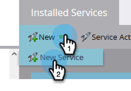

# Anslut [!DNL BrightTALK] till Marketo {#connect-brighttalk-to-marketo}

Lär dig koppla samman [!DNL BrightTALK] till er Marketo-instans. För att kunna göra detta måste du vara administratör för båda.

>[!NOTE]
>
>**Administratörsbehörigheter krävs**

## Steg i [!DNL BrightTALK] {#steps-in-brighttalk}

1. Logga in på [business.brighttalk.com/demandcentral](https://business.brighttalk.com/demandcentral/login){target="_blank"} och klicka **[!UICONTROL Connect Now]**.
1. Under [!UICONTROL Advanced Marketo Connector], klicka **[!UICONTROL Connect]**.
1. Du kommer till skärmen för inloggningsuppgifter och frågar efter: Klient-ID, Klienthemlighet, Identitetstjänstens URL och URL för återställningstjänst. Logga in på Marketo för att få den här informationen.

## Steg i Marketo {#steps-in-marketo}

>[!NOTE]
>
>Nu måste du skapa en [!DNL API Only User Role] och [!DNL API User] för att begränsa vilka behörigheter [!DNL BrightTALK] kommer att finnas i din Marketo-instans. Eftersom vi redan har artiklar för de stegen länkar vi dig till dem.

1. Skapa en [Användarroll endast för API](/help/marketo/product-docs/administration/users-and-roles/create-an-api-only-user-role.md){target="_blank"}.

1. [Skapa en API-användare](/help/marketo/product-docs/administration/users-and-roles/create-an-api-only-user.md){target="_blank"}, med [!DNL BrightTALK] API-roll som du skapade under steg 4.

1. Gå tillbaka till **[!UICONTROL Admin]** område.

   

1. Under **[!UICONTROL Integration]**, klicka **[!UICONTROL LaunchPoint]**.

   

1. Klicka på **[!UICONTROL New]** nedrullningsbar meny och välj **[!UICONTROL New Service]**.

   

1. Ange **[!UICONTROL Display Name]** efter eget val. Klicka på **[!UICONTROL Service]** nedrullningsbar meny och välj **[!UICONTROL Custom]** (do _not_ välj [!DNL BrightTALK]).

   

   >[!CAUTION]
   >
   >Kom ihåg att inte markera [!DNL BrightTALK] i listrutan. Det är ett fält som vi håller på att ta bort, och om du väljer det kan det skapa betydande problem med din [!DNL Marketo/BrightTALK] integrering.

1. Ange [!UICONTROL Description] efter eget val. Klicka på **[!UICONTROL API Only User]** och väljer [!DNL BrightTALK API User] du skapade under steg 5. Klicka på **[!UICONTROL Create]**.

   

1. Klicka **[!UICONTROL View Details]** för den anpassade tjänst du just skapade.

   

1. Kopiera (och spara) **[!UICONTROL Client ID]** och **[!UICONTROL Client Secret]**. Klicka på **[!UICONTROL Close]**.

   

1. Under **[!UICONTROL Integration]** väljer du **[!UICONTROL Web Services]**.

   

1. Under **[!UICONTROL Rest API]**, kopiera (och spara) **[!UICONTROL Endpoint]** och **[!UICONTROL Identity]**.

   

## Ytterligare steg i [!DNL BrightTALK] {#additional-steps-in-brighttalk}

1. Återgå till [!DNL BrightTALK] konfigurationsskärmen för anslutare från steg 3 och ange de inloggningsuppgifter som du sparade från steg 12 och 14.

När inloggningsuppgifterna har autentiserats har du anslutit [!DNL BrightTALK] till Marketo. Nästa steg är att bestämma [vilka datafält du vill synkronisera](https://support.brighttalk.com/hc/en-us/articles/115005131274-BrightTALK-Connector-for-Marketo-Choose-the-Fields-to-Sync){target="_blank"}.
