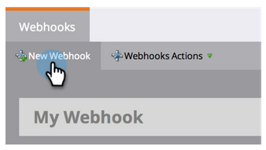

# Skapa en [!DNL Webhook] {#create-a-webhook}

Använd [!DNL Webhooks] om du vill dra nytta av webbtjänster från tredje part för att skicka textmeddelanden, utöka persondata och mycket mer.

1. Gå till området **[!UICONTROL Admin]**.

   

1. Klicka på **[!UICONTROL Webhooks]**.

   

1. Klicka på **[!UICONTROL New Webhook]**.

   

1. Namnge och konfigurera [!DNL Webhook].

   

   >[!NOTE]
   >
   >Detta inkluderar ofta att du anger dina inloggningsuppgifter för en tredjepartstjänst som en URL-parameter eller i POSTEN.

   * **[!UICONTROL URL]**: Ange den URL som du använder i din begäran till webbtjänsten. Om du vill infoga en token, till exempel personens e-postadress (**`{{lead.Email Address}}`**), klickar du på **[!UICONTROL Insert Token]** i din begäran.

   * **[!UICONTROL Template]**: Om du vill överföra information i begärans innehåll anger du det via nyttolastmallen. Mallar tillåts för följande typer av begäranden: POST, DELETE, PATCH eller PUT. Du kan använda dataformat som JSON eller XML. Om du vill infoga en token i mallen klickar du på **[!UICONTROL Insert Token]**.

   * **[!UICONTROL Request Token Encoding]**: Om tokenvärdena innehåller specialtecken (t.ex. ett et-tecken (&amp;)) anger du formatet för din begäran (**JSON** eller **Form/Url**).

   * **[!UICONTROL Response type]**: Välj formatet för det svar du får från tjänsten (**JSON** eller **XML**).

   * **[!UICONTROL Request Type]**: Välj den HTTP-metod som ska användas (DELETE, GET, PATCH, POST, PUT).

1. Klicka på **[!UICONTROL Create]**.

   

>[!NOTE]
>
>Läs mer i djupdykningen [[!DNL Webhooks]](https://experienceleague.adobe.com/en/docs/marketo-developer/marketo/webhooks/webhooks){target="_blank"}.
