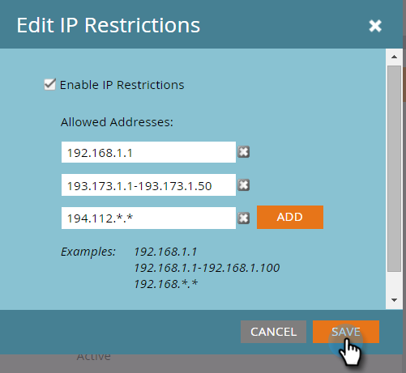

# Skapa ett Tillåtelselista för IP-baserad API-åtkomst {#create-an-allowlist-for-ip-based-api-access}

Ibland vill du bara ge API-åtkomst till en viss IP-adress eller ett adressintervall. För att göra detta aktiverar du först begränsningar och anger sedan de IP-adresser som får använda API:erna.

>[!NOTE]
>
>**Administratörsbehörigheter krävs**

1. Gå till **[!UICONTROL Admin]** område.

   

1. Klicka på **[!UICONTROL Web Services]**.

   

1. I **[!UICONTROL IP Restrictions]** område, klicka **[!UICONTROL Edit],** eller klicka **[!UICONTROL Edit IP Restrictions]** i det övre vänstra hörnet.

   

1. Kontrollera **[!UICONTROL Enable IP Restrictions]** och ange de IP-adresser som du vill Tillåtslista.

   

   >[!NOTE]
   >
   >Du kan ange en enstaka IP-adress eller ett intervall av dessa eller använda ett jokertecken.

1. Klicka **[!UICONTROL Add]** om du vill öppna ytterligare fält för att ange fler IP-adresser.

   

1. Klicka på **[!UICONTROL Save]**.

   
