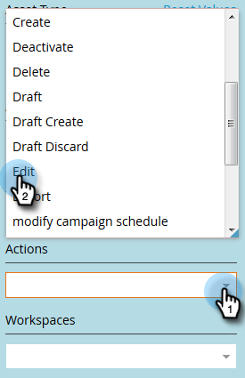
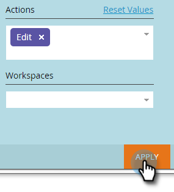

# Filtrera i granskningsspår {#filtering-in-audit-trail}

Filtrera efter tidsram, resurstyp, användare, åtgärd med mera.

1. Klicka på **[!UICONTROL Admin]**.

   

1. Välj **[!UICONTROL Audit Trail]** under **[!UICONTROL Security]**.

   

1. Klicka på filterikonen.

   

   >[!NOTE]
   >
   >Det finns en mängd möjliga sökparameterkombinationer. I det här exemplet hittar vi: _alla e-postmeddelanden - redigerade av alla - under de senaste sju dagarna_.

1. Klicka på listrutan **[!UICONTROL Period]** och välj **[!UICONTROL Last 7 Days]**.

   

1. Klicka på listrutan **[!UICONTROL Asset Type]** och välj **[!UICONTROL Email]**.

   

1. Klicka på listrutan **Aactions** och välj **[!UICONTROL Edit]**.

   

1. Klicka på **[!UICONTROL Apply]**.

   

1. Filtrerade resultat visas till vänster.

   

   Så ja!

   >[!NOTE]
   >
   >Om du har aktiverat arbetsytor visas granskningsdata för alla arbetsytor. Om du använder ett arbetsytefilter kommer Marketo ihåg det tidigare arbetsytevärdet varje gång du använder granskningsspår. Workspace-behörigheter på resursnivå tillämpas.

   >[!MORELIKETHIS]
   >
   >[Ändra information i granskningsspåret](/help/marketo/product-docs/administration/audit-trail/change-details-in-audit-trail.md)
