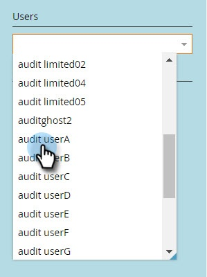

# Historik för användarinloggning {#user-login-history}

Användarens inloggningshistorik hjälper till att upprätthålla ansvarighet och säkerhet genom att visa exakt vem som har loggat in på din prenumeration, inklusive misslyckade inloggningsförsök.

>[!NOTE]
>
>**Förutsättningar**
>
>Du måste ha en roll med behörigheten Åtkomstinloggningshistorik aktiverad för att kunna visa användarinloggningshistoriken.

Historik för användarinloggning identifierar personer som loggar in via:

* Inloggningstid och -datum
* Användarens namn och e-postadress
* Roll
* Arbetsyta
* IP-adress

Så här visar du användarens inloggningshistorik:

1. Klicka på fliken **Admin** och klicka på **Användare och roller** under Säkerhet.

   

1. Klicka på fliken **Inloggningshistorik** . I listan visas de senaste inloggningarna.

   

1. Använd filtret för att begränsa sökningen.

   

1. Välj ett datumintervall med datumväljarna.

   

1. Du kan också välja i listrutan.

   

1. Välj användare i listrutan **Användare** .** **

   ** 

   **

1. Markera rutan **Endast misslyckade inloggningar** om du bara vill visa misslyckade inloggningar i sökningen.

   

1. Klicka på **Använd**.

   

   >[!NOTE]
   >
   >Användargränssnittet visar upp till 30 dagars data. Om du behöver mer kan du ladda ned de senaste sex månadernas data till en csv-fil.

   >[!NOTE]
   >
   >**Relaterade artiklar**
   >
   >    
   >    
   >    * [Översikt över granskningsspår](audit-trail-overview.md)

