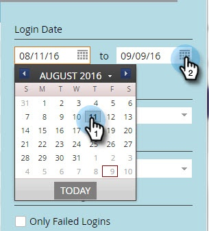

# Historik för användarinloggning {#user-login-history}

Användarens inloggningshistorik hjälper till att upprätthålla ansvarighet och säkerhet genom att visa exakt vem som har loggat in på din prenumeration, inklusive misslyckade inloggningsförsök.

>[!PREREQUISITES]
>
>Du måste ha en roll med behörigheten Åtkomstinloggningshistorik aktiverad för att kunna visa användarinloggningshistoriken.

Historik för användarinloggning identifierar personer som loggar in via:

* Inloggningstid och -datum
* Användarens namn och e-postadress
* Roll
* Arbetsyta
* IP-adress

Så här visar du användarens inloggningshistorik:

1. Gå till **[!UICONTROL Admin]** område.

   

1. Klicka på under Dokumentskydd **[!UICONTROL Users & Roles]**.

   

1. Klicka på **[!UICONTROL Login History]** -fliken. I listan visas de senaste inloggningarna.

   

1. Använd filtret för att begränsa sökningen.

   

1. Välj ett datumintervall med datumväljarna.

   

1. Du kan också välja i listrutan.

   

1. Välj användare från **[!UICONTROL Users]** nedrullningsbar meny.

   

1. Kontrollera **[!UICONTROL Only Failed Logins]** om du bara vill visa misslyckade inloggningar i sökningen.

   

1. Klicka på **[!UICONTROL Apply]**.

   

   >[!NOTE]
   >
   >Användargränssnittet visar upp till 30 dagars data. Om du behöver mer kan du ladda ned de senaste sex månadernas data till en csv-fil.

   >[!MORELIKETHIS]
   >
   >[Översikt över granskningsspår](/help/marketo/product-docs/administration/audit-trail/audit-trail-overview.md)
