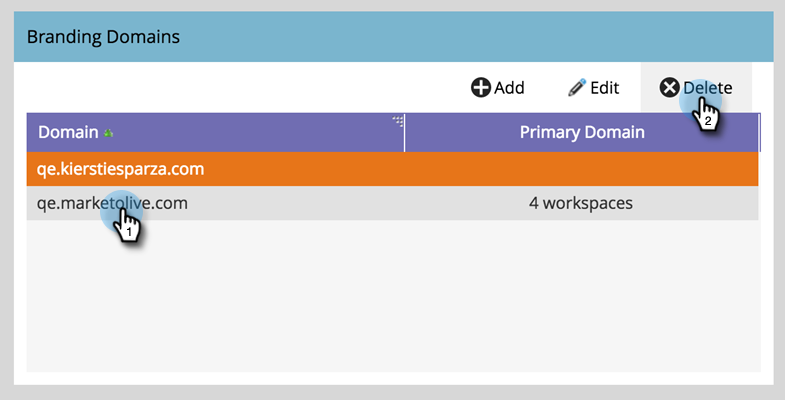

# Ta bort en profileringsdomän {#delete-a-branding-domain}

1. I My Marketo klickar du på **Admin** och sedan på länken **E-post**.

   

1. Markera den domän som du vill ta bort i tabellen Varumärken och klicka på **Ta bort**.

   

   >[!NOTE]
   >
   >Om du vill ta bort den primära profileringsdomänen måste du först välja en annan profileringsdomän som primär.
