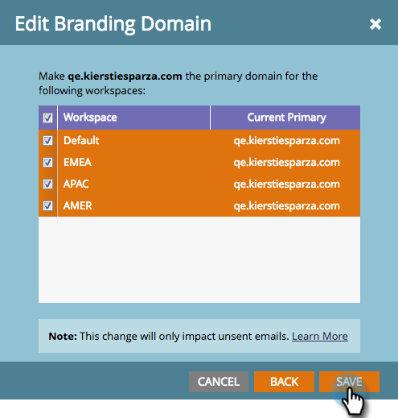

# Redigera din standardprofileringsdomän med arbetsytor {#edit-your-default-branding-domain-with-workspaces}

1. Gå till **Administratör** område.

   

1. Klicka **E-post**.

   

1. I tabellen Varumärkesdomäner väljer du den aktuella generiska domänen och klickar på Redigera för att ändra den till företagets varumärkesdomän.

   

   >[!NOTE]
   >
   >**Lägg till** fungerar inte förrän du har redigerat den generiska domänen. **Ta bort** fungerar inte förrän du lägger till en andra domän.
   >
   >Du kan inte lägga till ytterligare en domän förrän du först redigerar den generiska domänen.

1. Ange namnet på din standarddomän och klicka på **Nästa**.

   

1. Klicka **Spara**.

   

>[!NOTE]
>
>När du lägger till ytterligare profileringsdomäner kan du välja att göra den till din primära domän för en eller flera arbetsytor, och alla befintliga oskickade e-postmeddelanden anges till &quot;Standard&quot; och alla nya e-postmeddelanden blir standard till den primära domänen. Du kan åsidosätta detta per e-post.

Nu kan du [lägga till ytterligare varumärkesdomäner](/help/marketo/product-docs/administration/email-setup/add-multiple-branding-domains/add-an-additional-branding-domain-with-workspaces.md) du behöver för arbetsytorna.
