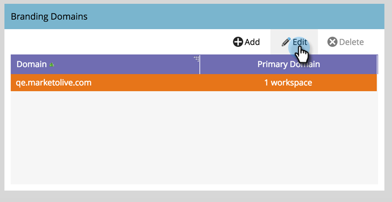

# Redigera din standardprofileringsdomän med arbetsytor {#edit-your-default-branding-domain-with-workspaces}

1. Gå till området **[!UICONTROL Admin]**.

   

1. Klicka på **[!UICONTROL Email]**.

   

1. I tabellen [!UICONTROL Branding Domains] väljer du den aktuella generiska domänen och klickar på **[!UICONTROL Edit]** för att ändra den till företagets varumärkesdomän.

   

   >[!NOTE]
   >
   >**[!UICONTROL Add]** fungerar inte förrän du har redigerat den generiska domänen. **[!UICONTROL Delete]** fungerar inte förrän du lägger till en andra domän.
   >
   >Du kan inte lägga till ytterligare en domän förrän du först redigerar den generiska domänen.

1. Ange namnet på din standarddomän och klicka på **[!UICONTROL Next]**.

   

1. Klicka på **[!UICONTROL Save]**.

   

>[!NOTE]
>
>När du lägger till ytterligare profileringsdomäner kan du välja att göra den till din primära domän för en eller flera arbetsytor. Alla befintliga oskickade e-postmeddelanden anges till &quot;Standard&quot; och alla nya e-postmeddelanden kommer att vara standarddomänen. Du kan åsidosätta detta per e-post.

Nu kan du [lägga till ytterligare profileringsdomäner](/help/marketo/product-docs/administration/email-setup/add-multiple-branding-domains/add-an-additional-branding-domain-with-workspaces.md) som du behöver för arbetsytorna.
