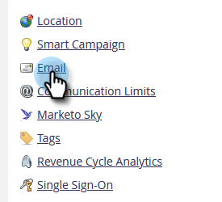

# Ändra hämtningsgränser för anpassade objekt i snabbskriptning {#change-custom-object-retrieval-limits-in-velocity-scripting}

Om du använder snabbskriptet för att visa anpassade objektdata i e-postmeddelanden kan den här funktionen vara till för dig. Som standard har du åtkomst till 10 överordnade anpassade objekt från Snabbredigeringsskript. Om du behöver få tillgång till mer kan du läsa vidare.

## Vad är Velocity? {#what-is-velocity}

[Apache-hastighet](https://velocity.apache.org/) är ett språk som bygger på Java och som är utformat för att skapa mallar och skript för HTML. Marketo tillåter att den används i e-postsammanhang genom [skripttoken](/help/marketo/product-docs/email-marketing/general/using-tokens/create-an-email-script-token.md). Detta ger bland annat åtkomst till data som lagras i anpassade objekt.

Du kan referera till överordnade och underordnade anpassade objekt som är direkt kopplade till lead- eller kontaktpersonen, men inte till anpassade objekt på tredje nivån. För varje anpassat objekt är de 10 senast uppdaterade posterna per person/kontakt tillgängliga vid körning och beställs från den senast uppdaterade (vid 0) till den äldsta (vid 9).

## Ändra gränsen {#how-to-change-the-limit}

1. Gå till **Administratör** -avsnitt.

   

1. Klicka **E-post**.

   

1. Ange en ny överordnad hämtningsgräns i tabellen Hämtningsgränser för anpassat objekt och klicka på **Spara ändringar**.

   

>[!NOTE]
>
>Värdet för överordnad hämtningsgräns måste vara mellan 10 och 100. Den underordnade hämtningsgränsen ställs in automatiskt åt dig. Detta görs genom att dividera 1000 med den överordnade hämtningsgränsen. Om du t.ex. anger gränsen för Överordnad till 50 blir gränsen för Underordnad 20 (1 000‡ 50 = 20).

Söt! Nu kan du få åtkomst till fler anpassade objekt från Velocity-skript.
