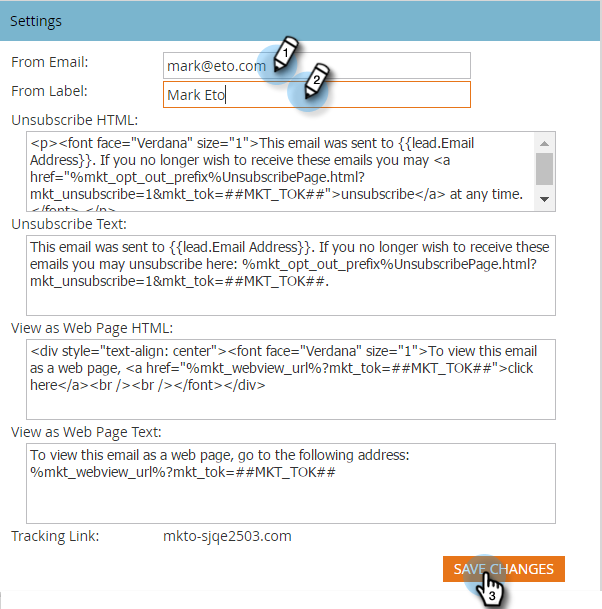

# Ändra standard från e-post och från etikett {#change-the-default-from-email-and-from-label}

Varje administratörsanvändare kan ändra standardvärdena för **Från e-post** och **Från etikett** så att standardinställningarna används när de skapar nya e-postmeddelanden.

>[!NOTE]
>
>**Administratörsbehörigheter krävs**

1. Gå till **Administratör** -avsnitt.

   

1. Klicka **E-post**.

   

1. Ange de standardvärden som du vill använda **Från e-post** och **Från etikett** sedan klicka **Spara ändringar**.

   

>[!NOTE]
>
>Ändringen gäller endast dig och inte andra Marketo-användare.

Bra jobbat! Varje gång du skapar ett nytt e-postmeddelande används de standardvärden som du anger.
