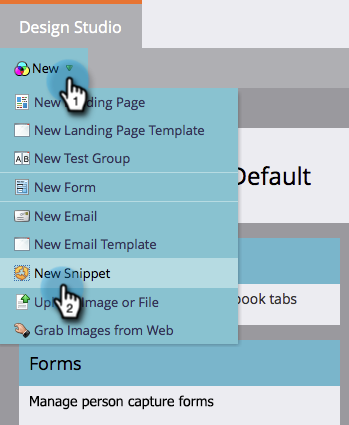
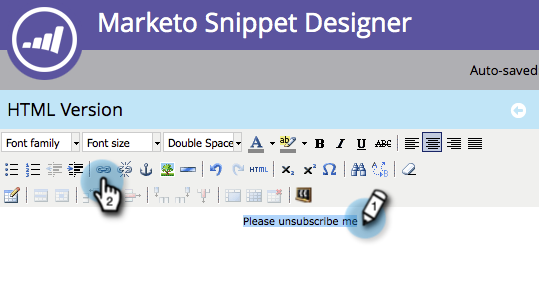
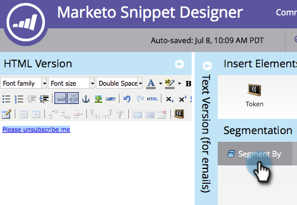

# Gör ditt meddelande om att avbryta prenumerationen dynamiskt för språk {#make-your-unsubscribe-message-dynamic-for-languages}

Standardmeddelandet och länken för att avbryta prenumerationen är på engelska. Du kan använda dynamiskt innehåll för att visa det på olika språk.

>[!NOTE]
>
>Vi har skapat den här lilla lektionen nedan åt dig. Det är en bra metod, men det kan man göra på andra sätt.

## Förbered dina data {#prepare-your-data}

1. [Skapa ett anpassat ](/help/marketo/product-docs/administration/field-management/create-a-custom-field-in-marketo.md) fält med namnet&quot;Önskat språk&quot;. (Konfigurera den i CRM om du vill att det här fältet ska synkroniseras).

   >[!TIP]
   >
   >I framtiden ska du använda det här fältet när du [skapar ett formulär](/help/marketo/product-docs/demand-generation/forms/creating-a-form/create-a-form.md) för att hämta språkinställningar.

## Skapa segmentering {#create-segmentation}

1. Gå till **databasen**.

   

1. I listrutan **Nytt** klickar du på **Nytt segment**.

   

1. Namnge segmenteringen **Önskat språk**. Klicka på **Lägg till segment**. Skriv på ett språk.

   

   >[!NOTE]
   >
   >Standardsegmentet är engelska.

1. Fortsätt att lägga till segment tills alla språk är representerade. Klicka på **Skapa**.

   

1. Markera ett segment.

   

1. Gå till fliken **Smart lista**. Ange **Önskat språk** i sökfältet. Dra och släpp filtret på arbetsytan.

   

1. Ange lämpligt motsvarande språk.

   

1. Upprepa för alla dina olika språk. Välj sedan listrutan **Segmenteringsåtgärder** och klicka på **Godkänn**.

   

## Skapa ett fragment {#create-a-snippet}

1. Gå till **Design Studio**.

   

1. I listrutan **Nytt** klickar du på **Nytt fragment**.

   

1. Namnge fragmentet **Avsluta prenumeration på meddelande**. Klicka på **Skapa**.

   

1. Skriv ditt standardmeddelande för att avbryta prenumerationen, markera det och klicka på hyperlänksikonen.

   

1. Kopiera och klistra in denna token: `{{system.unsubscribeLink}}` i fältet **Länk-URL**. Klicka på **Infoga**.

   

1. Välj **Segmentera med** i segmenteringsavsnittet.

   

1. I listrutan Segmentering skriver du **Preferred** och väljer **Preferred Language**. Klicka på **Spara**.

   

1. Markera ett segment i trädet. Skriv ditt avbeställningsmeddelande på det språket.

   

1. Kopiera och klistra in samma token: `{{system.unsubscribeLink}}` i fältet **Länk-URL**. Klicka på **Infoga**.

   

1. Upprepa för alla segment. Gå sedan tillbaka till Design Studio, klicka på listrutan **Fragmentåtgärder** och klicka på **Godkänn**.

   

   Häftig. Nästan klart.

## Använd kodfragment i ett e-postmeddelande {#use-snippet-in-an-email}

1. Klicka på det redigerbara elementet i e-postredigeraren. Klicka sedan på kugghjulsikonen och välj **Ersätt med fragment**. Om du markerar ett redigerbart fragmentelement klickar du på kugghjulsikonen och väljer **Redigera**.

   

1. Sök efter och välj kodfragment i listrutan och klicka på **Spara**.

   

1. Om du vill testa den klickar du på **Bakåt**..

   

1. ...sedan fliken **Dynamisk**.

   

1. Klicka på de olika språken för att se ändringen av fragmentet.

   

   >[!TIP]
   >
   >Naturligtvis kan du även redigera resten av e-postmeddelandet för dynamiskt språk. När du är klar gör du samma sak på sidan för att avbryta prenumerationen.

## Anpassa din sida för avanmälan med dynamiskt innehåll {#customizing-your-unsubscribe-page-with-dynamic-content}

Om du vill att dina medarbetare ska komma till en avanmälningssida på det språk de föredrar, kan du använda dynamiskt innehåll på landningssidan och bekräftelsesidan.

1. Gå till Design Studio.

   

1. Skriv in _Unsubscribe_ i sökfältet. Du hittar sidorna för Avbeställ.

   

1. Klicka på **Redigera utkast**.

   

1. Välj **Segmentera med**.

   

1. Hitta segmentet Önskat språk. Klicka på **Spara**.

   

   Redigera innehållet för varje landningssida, godkänn och var redo!

   >[!NOTE]
   >
   >Läs mer om [dynamiskt innehåll](/help/marketo/product-docs/personalization/segmentation-and-snippets/segmentation/understanding-dynamic-content.md) och alla coola saker du kan göra.
