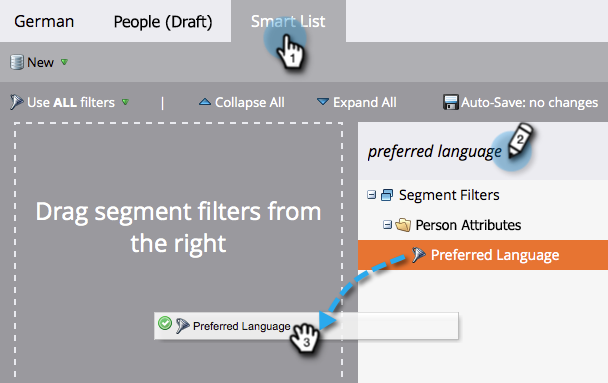

# Gör ditt avbeställningsmeddelande dynamiskt för språk {#make-your-unsubscribe-message-dynamic-for-languages}

Standardmeddelandet och länken för att avbryta prenumerationen är på engelska. Du kan använda dynamiskt innehåll för att visa det på olika språk.

>[!NOTE]
>
>Den här artikeln är en bra metod, men kan användas på andra sätt.

## Förbered dina data {#prepare-your-data}

1. [Skapa ett anpassat fält](/help/marketo/product-docs/administration/field-management/create-a-custom-field-in-marketo.md) med namnet&quot;Önskat språk&quot;. (Konfigurera den i CRM om du vill att det här fältet ska synkroniseras).

   >[!TIP]
   >
   >Använd det här fältet när du [skapa ett formulär](/help/marketo/product-docs/demand-generation/forms/creating-a-form/create-a-form.md) för att hämta språkinställningar.

## Skapa segmentering {#create-segmentation}

1. Gå till **[!UICONTROL Database]**.

   

1. I **[!UICONTROL New]** nedrullningsbar meny, klicka **[!UICONTROL New Segmentation]**.

   

1. Namnge segmenteringen **[!UICONTROL Preferred Language]**. Klicka på **[!UICONTROL Add Segment]**. Skriv på ett språk.

   

   >[!NOTE]
   >
   >Standardsegmentet är engelska.

1. Fortsätt att lägga till segment tills alla språk är representerade. Klicka på **[!UICONTROL Create]**.

   

1. Markera ett segment.

   

1. Gå till **[!UICONTROL Smart List]** -fliken. Retur **[!UICONTROL Preferred Language]** i sökfältet. Dra och släpp filtret på arbetsytan.

   

1. Ange lämpligt motsvarande språk.

   

1. Upprepa för alla dina olika språk. Välj sedan **[!UICONTROL Segmentation Actions]** nedrullningsbar meny och klicka **[!UICONTROL Approve]**.

   

## Skapa ett fragment {#create-a-snippet}

1. Gå till **[!UICONTROL Design Studio]**.

   

1. I **[!UICONTROL New]** listruta, klicka **[!UICONTROL New Snippet]**.

   

1. Namnge fragmentet **Avbeställ meddelande**. Klicka på **[!UICONTROL Create]**.

   

1. Skriv ditt standardmeddelande för att avbryta prenumerationen, markera det och klicka på hyperlänksikonen.

   

1. Kopiera och klistra in denna token: `{{system.unsubscribeLink}}` till **[!UICONTROL URL]** fält. Klicka på **[!UICONTROL Insert]**.

   

1. Välj **[!UICONTROL Segment By]** i **[!UICONTROL Segmentation]** -avsnitt.

   

1. Från **[!UICONTROL Segmentation]** nedrullningsbar meny, skriva in **[!UICONTROL Preferred]** och markera **[!UICONTROL Preferred Language]**. Klicka på **[!UICONTROL Save]**.

   

1. Markera ett segment i trädet. Klicka på avbeställningen och klicka sedan på länkikonen.

   

1. Se till att `{{system.unsubscribeLink}}` finns fortfarande i **[!UICONTROL URL]** fält. Redigera **[!UICONTROL Display Text]** för att matcha det språk du valde. Klicka på **[!UICONTROL Apply]**.

   

1. Upprepa för alla segment. Gå sedan tillbaka till **[!UICONTROL Design Studio]** klickar du på **[!UICONTROL Snippet Actions]** och klicka **[!UICONTROL Approve]**.

   

Häftig. Nästan klart!

## Använd kodfragment i ett e-postmeddelande {#use-snippet-in-an-email}

1. Klicka på det redigerbara elementet i e-postredigeraren. Klicka sedan på kugghjulsikonen och välj **[!UICONTROL Replace with Snippet]**. Om du markerar ett redigerbart fragmentelement klickar du på kugghjulsikonen och väljer **[!UICONTROL Edit]**.

   

1. Söka efter och markera fragmentet i listrutan och klicka på **[!UICONTROL Save]**.

   

1. Klicka på **[!UICONTROL Back]**...

   

1. ...sedan **[!UICONTROL Dynamic]** -fliken.

   

1. Klicka på de olika språken för att se ändringen av fragmentet.

   

   >[!TIP]
   >
   >Naturligtvis kan du även redigera resten av e-postmeddelandet för dynamiskt språk. När du är klar gör du samma sak på sidan för att avbryta prenumerationen.

## Anpassa din sida för avanmälan med dynamiskt innehåll {#customizing-your-unsubscribe-page-with-dynamic-content}

Om du vill att dina medarbetare ska komma till en avanmälningssida på det språk de föredrar, kan du använda dynamiskt innehåll på landningssidan och bekräftelsesidan.

1. Navigera till **[!UICONTROL Design Studio]**.

   

1. Skriv in _Avbeställ_ i sökfältet och välj önskad sida för att avbryta prenumerationen.

   

1. Klicka på **[!UICONTROL Edit Draft]**.

   

1. Välj **[!UICONTROL Segment By]**.

   

1. Hitta **[!UICONTROL Preferred Language]** segment. Klicka på **[!UICONTROL Save]**.

   

   Redigera innehållet för varje landningssida, godkänn och var redo!

   >[!NOTE]
   >
   >Läs mer om [dynamiskt innehåll](/help/marketo/product-docs/personalization/segmentation-and-snippets/segmentation/understanding-dynamic-content.md) och alla coola grejer du kan göra.
