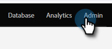

# Open Tracking för e-post på kampanjnivå {#email-open-tracking-at-campaign-level}

Med den här funktionen kan du styra spårningen av e-postöppningar, antingen en gång för varje öppet kampanj eller en gång för varje e-postmeddelande, oavsett hur många gånger det används i olika kampanjer.

>[!NOTE]
>
>**Administratörsbehörigheter krävs**

1. Gå till området **Admin**.

   

1. Klicka på **Smart kampanj**.

   

1. Bredvid _Inställningar för e-post öppnas_, klicka på **Redigera**.

   

1. Klicka på listrutan, välj önskad inställning och klicka på **Spara**.

   

<table><tbody>
  <tr>
    <td><b>Aktiverad</b></td>
    <td>E-postöppningar spåras separat för varje kampanj.</td>
  </tr>
  <tr>
    <td><b>Handikappade</b></td>
    <td>E-postöppningar räknas bara utifrån när en unik person öppnas.</td>
  </tr>
</tbody>
</table>
