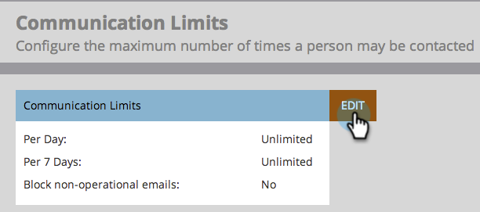
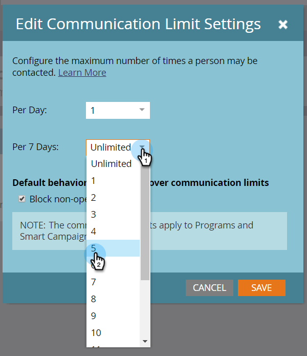

# Aktivera kommunikationsgränser {#enable-communication-limits}

Det är viktigt att inte överkommunicera med era medarbetare. Genom att ange kommunikationsgränser kan du förhindra att organisationen skickar för många e-postmeddelanden.

>[!NOTE]
>
>**Administratörsbehörigheter krävs**

1. Gå till **Administratör** område.

   

1. Klicka **Kommunikationsbegränsningar**.

   

1. Klicka **Redigera**.

   

   >[!NOTE]
   >
   >Per dag baseras på kalenderdagen i prenumerationstidszonen (midnatt-midnatt).

1. Klicka på **Per dag** och välj önskad gräns. I det här exemplet väljer vi 1.

   

   >[!TIP]
   >
   >Du kan också välja **Egen** om inget av de förinställda alternativen fungerar för dig.

1. Klicka på **Per 7 dagar** och välj önskad gräns. I det här exemplet väljer vi 5.

   

1. Välj **Blockera icke-fungerande e-postmeddelanden**.

   

   >[!NOTE]
   >
   >Läs mer om vad [e-postmeddelanden](/help/marketo/product-docs/email-marketing/general/functions-in-the-editor/make-an-email-operational.md) är.

1. Klicka **Spara**.

   

   >[!NOTE]
   >
   >**Exempel**
   >
   >Inställningarna ovan innebär att personer inte får mer än **1 e-post per dag** eller mer än **5 i en sjudagarsperiod**.

   >[!NOTE]
   >
   >Kommunikationsbegränsningar gäller automatiskt för alla e-post- och engagemangsprogram.

>[!MORELIKETHIS]
>
>[Använd kommunikationsbegränsningar för smart kampanj](/help/marketo/product-docs/core-marketo-concepts/smart-campaigns/using-smart-campaigns/apply-communication-limits-to-smart-campaign.md)
