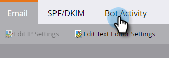

# Filtrerar e-postsatsaktivitet {#filtering-email-bot-activity}

Ibland kan aktiviteten för e-postrobot felaktigt blåsa upp e-postöppningen och klicka på data. Åtgärda problemet genom att följa stegen nedan.

Vi använder tre olika metoder för att bekräfta båda aktiviteterna:

* Matcha med [Interactive Advertising Bureau bot list](https://www.iab.com/guidelines/iab-abc-international-spiders-bots-list/){target=&quot;_blank&quot;}: Aktiviteter som matchar något i listan IAB UA/IP (User Agent/IP address) markeras som bots.
* Matcha med dolda länkar UA/IP: Vi lägger till en dold länk till alla e-postmeddelanden och fångar UA/IP-klick som kommer från dem. Aktiviteter som matchar dessa UA/IP-adresser markeras som bottar.
* Matcha med närhetsmönster: När fler än två aktiviteter inträffar samtidigt (under två sekunder) identifieras de som bottar.

I e-postlänkens klickning och öppningsaktivitet via e-post fylls nya attribut med värdena nedan:

* Aktiviteter som identifieras som bottar har &quot;Bot Activity&quot; som &quot;True&quot; och &quot;Bot Activity Pattern&quot; som det identifierade mönstret/metoden
* Aktiviteter som inte identifieras som&quot;bottenaktivitet&quot; kommer att ha&quot;bottenaktivitet&quot; som&quot;falsk&quot; och&quot;bitaktivitetsmönster&quot; som&quot;inget/inget&quot;
* Aktiviteter som inträffade innan de här attributen introducerades har &quot;Rotaktivitet&quot; som &quot; (tom) och &quot;Punktaktivitetsmönster&quot; som &quot; (tom)

1. Klicka **Administratör**.

   

1. Klicka **E-post**.

   

1. Klicka på **Rotaktivitet** -fliken.

   

1. Klicka på **Aktivera identifiering av punktaktivitet** skjutreglage som ska aktiveras.

   

>[!NOTE]
>
>Du kan välja separat om du vill att båda aktiviteterna ska loggas eller inte. Om du väljer att inte göra det kan du se en nedgång i e-postmeddelandet öppnas och klicka på falska siffror filtreras bort.

**VALFRITT STEG**: Om du vill inaktivera funktionen avmarkerar du bara reglaget. Om du inaktiverar det gör data **not** återställ.

>[!TIP]
>
>Utnyttja informationen om robotaktivitet i smarta listor via boolesk aktivitet (ja/nej) och Bot Activity Pattern (Bot Activity Pattern) i filtren&quot;Click Link in Email&quot; och&quot;Open Email&quot; (Öppna e-post) och&quot;Click Link in Email&quot; och&quot;Open Email&quot; (Öppna e-post).
