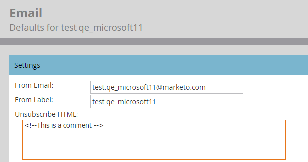

# Ta bort Avbeställ text från Admin > E-postavsnitt {#remove-unsubscribe-text-from-the-admin-email-section}

Den enda anledningen till att du någonsin helt bör ta bort innehållet som inte längre är prenumerant i området **[!UICONTROL Admin]** > **[!UICONTROL Email]** är om du väljer att skapa länken för att avbryta prenumerationen i e-postmallarna. Textrutan har en validering som inte tillåter att du sparar utan innehåll. Du kan kringgå detta genom att lägga till en liten HTML-kommentar. HTML-kommentaren visas inte i e-postklienten eftersom den återger e-postmeddelandet i HTML och kommentarerna utelämnas. Så här gör du.

1. Gå till området **[!UICONTROL Admin]**.

   

1. Klicka på **[!UICONTROL Email]**.

   

1. Markera all text och tryck på **[!UICONTROL Delete]**.

   >[!CAUTION]
   >
   >Innan du tar bort kopierar/klistrar du in detta i ett textdokument som en säkerhetskopia.

1. Skriv in `<!--This is a comment -->`.

   

1. Klicka på **[!UICONTROL Save Changes]**.

   

>[!NOTE]
>
>För **Avbeställ text** måste du lägga till ett enda tecken. Använd streck eller punkt.
