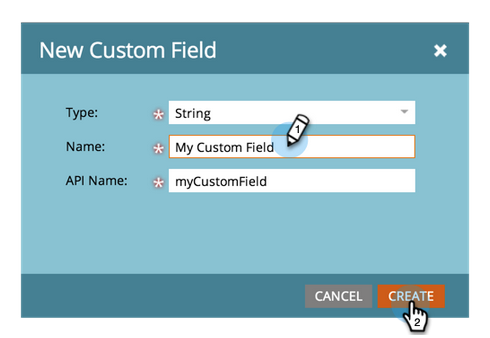

# Skapa ett anpassat fält i Marketo {#create-a-custom-field-in-marketo}

Om du behöver ett nytt anpassat fält i Marketo för att lagra/hämta data, så här skapar du ett.

1. Gå till Admin och klicka på Fälthantering.

   

   >[!TIP]
   >
   >Om du vill att fälten ska synkroniseras med CRM skapar du dem i CRM så skapas de automatiskt i Marketo.

1. Klicka på Nytt anpassat fält.

   

1. Välj fälttyp. Detta ändrar hur det återges i smarta listor och formulär i Marketo.

   >[!TIP]
   >
   >Läs ordlistan för [anpassade fälttyper](custom-field-type-glossary.md).

   

1. Ange namnet som du vill att det ska visas i Marketo. API-namnet genereras automatiskt. Du kan ändra den, men du kan inte byta namn på den när den har angetts. Klicka på Skapa när du är klar.

>[!CAUTION]
>
>Fältnamn får inte börja med följande tecken: **. &amp; +[]**

>[!NOTE]
>
>API-namnet används av SOAP API och andra serverdelsprocesser.

Du kan nu använda det här anpassade fältet i formulär, flödessteg och smarta listor.