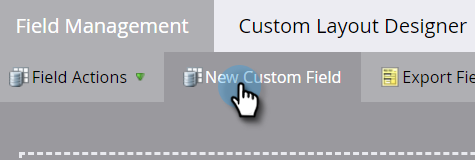

# Skapa ett anpassat fält i Marketo {#create-a-custom-field-in-marketo}

Om du behöver ett nytt anpassat fält i Marketo Engage för att lagra/hämta in data, så här skapar du ett.

1. Gå till **[!UICONTROL Admin]** område.

   

1. Klicka på **[!UICONTROL Field Management]**.

   

   >[!TIP]
   >
   >Om du vill att fälten ska synkroniseras med CRM skapar du dem i CRM så skapas de automatiskt i Marketo.

1. Klicka på **[!UICONTROL New Custom Field]**.

   

1. Välj fälttyp. Detta ändrar hur det återges i smarta listor och formulär i Marketo.

   >[!TIP]
   >
   >Kolla in [Ordlista för anpassade fälttyper](/help/marketo/product-docs/administration/field-management/custom-field-type-glossary.md).

   

1. Ange [!UICONTROL Name] som du vill att den ska visas i Marketo. The [!UICONTROL API Name] genereras automatiskt. Du kan ändra den, men du kan inte byta namn på den när den har angetts. Klicka **[!UICONTROL Create]** när det är klart.

>[!CAUTION]
>
>Fältnamn får inte börja med följande tecken: **. &amp; +[]**

>[!NOTE]
>
>API-namnet används av SOAP API och andra serverdelsprocesser.

Nu kan du använda det här anpassade fältet i formulär, flödessteg och smarta listor!
