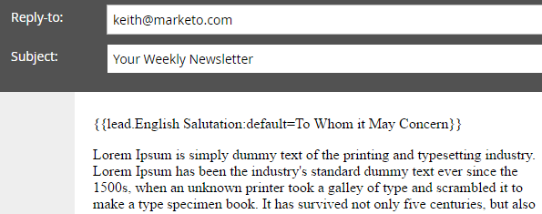

# Skapa och använda ett sammanfogat strängfält (formel) {#create-and-use-a-concatenated-string-formula-field}

Du kan kombinera värden från flera fält eller skapa ett villkorsstyrt värde med hjälp av ett Marketo-formelfält.

1. Gå till **[!UICONTROL Admin]** område.

   

1. Klicka på **[!UICONTROL Field Management]**.

   

1. Klicka på **[!UICONTROL New Custom Field]**.

   

1. Välj **[!UICONTROL Formula]** för **[!UICONTROL Type]**.

   

1. Ange **[!UICONTROL Name]** för fältet klickar du **[!UICONTROL Create]**.

   

1. Sök och välj formelfält och klicka sedan **[!UICONTROL Edit Rules]**.

   

1. Lägg till två alternativ och definiera dem som skärmbilden nedan.

   

   >[!TIP]
   >
   >Läs mer om [variabler för flödessteg](/help/marketo/product-docs/core-marketo-concepts/smart-campaigns/flow-actions/use-tokens-in-flow-steps.md).

1. Nu kan du lägga till formelfältet som en token i ett e-postmeddelande.

   

>[!NOTE]
>
>Formelfält kan användas på landningssidor, e-postmeddelanden och kolumner för smarta listor (de exporteras inte). E-postmeddelanden med formelfält kan _not_ skickas med en batchkampanj. Använd en [e-postskripttoken](/help/marketo/product-docs/email-marketing/general/using-tokens/create-an-email-script-token.md) i detta scenario.

Bra jobbat! Nu har du ett smart fält som vet vilken hälsningsfras som ska inkluderas baserat på kön. Ha så kul och bli kreativ.
