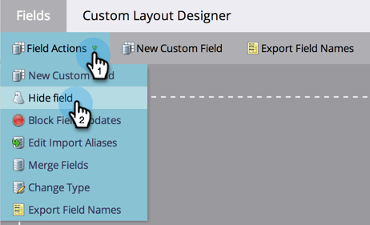

# Ta bort ett anpassat fält i Marketo {#delete-a-custom-field-in-marketo}

>[!NOTE]
>
>**Administratörsbehörigheter krävs**

Du kanske vill ta bort ett fält som du har skapat tidigare om du inte längre använder det. Tyvärr kan du inte ta bort fält i Marketo, men du _kan_ dölj dem från användargränssnittet.

1. Gå till **[!UICONTROL Admin]** område.

   

1. Klicka på **[!UICONTROL Field Management]**.

   

1. Klicka på **[!UICONTROL Field Actions]** nedrullningsbar meny och välj **[!UICONTROL Hide Field]**.

   

   Detaljerade stegvisa instruktioner finns i [dölja och visa ett fält](/help/marketo/product-docs/administration/field-management/hide-and-unhide-a-field.md).
