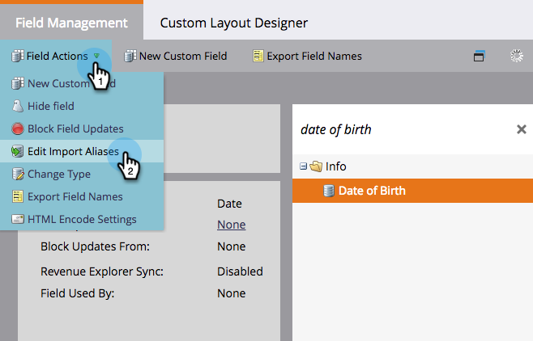

# Redigera fältalias för listimport {#edit-field-aliases-for-list-import}

När du importerar en lista med okända rubriker kan du skapa fältalias som gör det enklare. Du kan även redigera dessa alias i fälthantering. Kolla in den.

>[!NOTE]
>
>**Administratörsbehörigheter krävs**

1. Under **Admin** klickar du på **Fälthantering**.

   

1. Sök efter och markera fältet som du vill lägga till ett alias i.

   

1. Klicka på **Redigera importalias** i listrutan Fältåtgärder.

   

1. Ange ett alias och klicka på **Spara**.

   

>[!TIP]
>
>Klicka på **Lägg till ytterligare en** och ange fler alias om du behöver dem.

Titta på det där! Om du importerar ett kalkylblad med en kolumn som heter &quot;DOB&quot;, kommer Marketo automatiskt att identifiera det som &quot;Födelsedatum&quot; och importera data till rätt fält.

